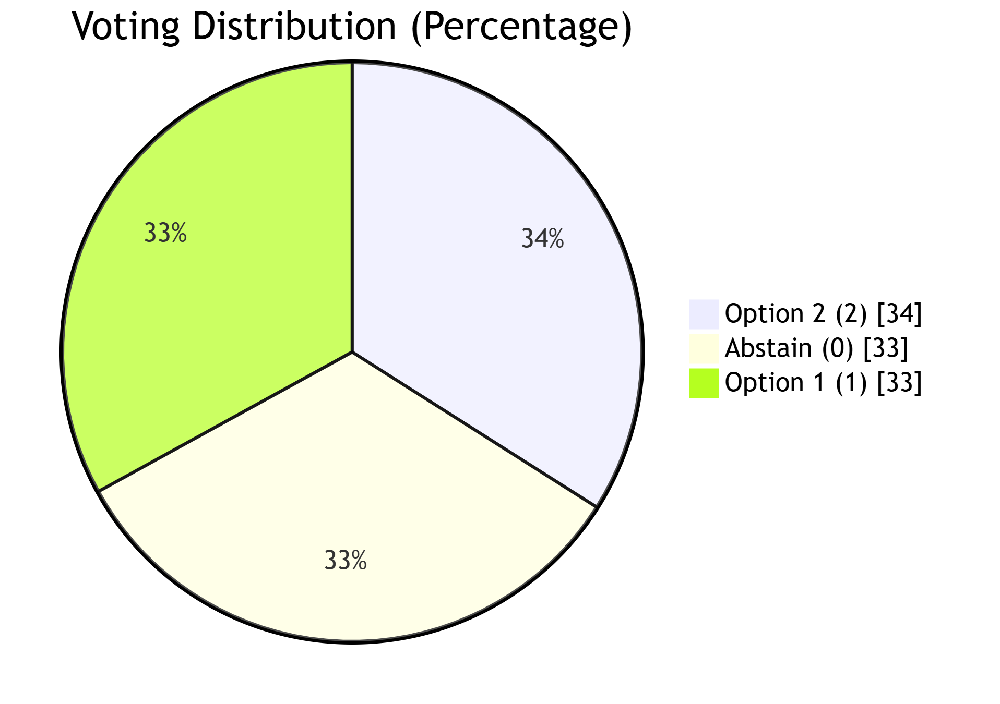
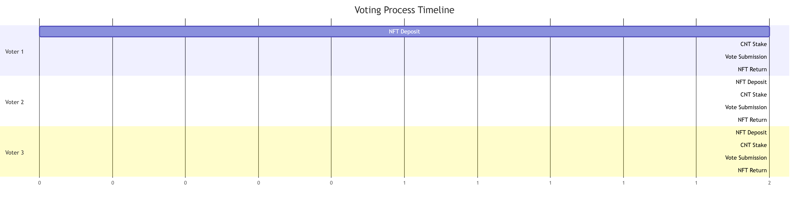
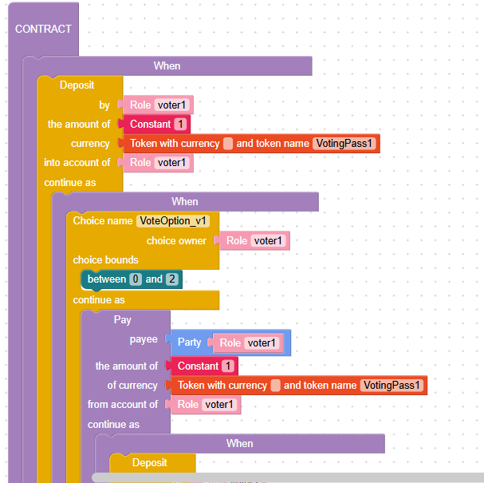
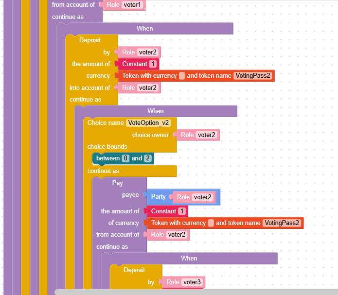

# Governance Voting Contract using NFT & On-chain CNT Lookup

## Governance Voting Contract using NFT & On-chain CNT Lookup


This Marlowe contract implements a decentralized governance voting system on Cardano, where each voter is authenticated through a unique NFT and vote weight is determined by the amount of **Cardano Native Token (CNT)** held in their stake address (queried off-chain).

***

### 📘 Overview


* ✅ **Eligibility via NFT**: Only users holding a `VotingPass` NFT can participate.
* 🔍 **Vote weight by on-chain CNT**: Voter does **not deposit CNT**. CNT balance is looked up off-chain via the stake address bound to their NFT.
* ⚖️ **Vote options**: `1 = YES`, `2 = NO`, `0 = ABSTAIN`.
* 🔁 **Revoting**: Allowed by resubmitting the same `ChoiceId` (newest value is counted).
* 🎯 **NFT returned** immediately after a vote is cast.
* 🔚 **Contract ends** when all votes are submitted or upon `votingDeadline`.

***

### 🔄 Contract Flow

#### 1. 🎫 NFT Verification

Each voter deposits a unique `VotingPass` NFT to prove eligibility.

#### 2. 🗳️ Cast Vote

Each voter casts one vote using:

* `ChoiceId` (e.g., `VoteOption_v1`)
* `ChoiceValue` = `1`, `2`, or `0`

Revoting is allowed before the deadline.

#### 3. 🎫 NFT Return

After casting the vote, the NFT is returned immediately to the voter.

#### 4. 🕓 Deadline & Closure

The contract closes once all 5 voters have participated or the `votingDeadline` is reached.

***

### 📥 Off-chain Vote Tally

After the contract closes:

* Query each voter's stake address based on NFT ownership.
* Lookup their CNT token balance.
* Combine their `ChoiceValue` and CNT to compute weighted voting totals.

Validations (off-chain):

* ✅ Quorum: Minimum number of non-abstain votes.
* ✅ Minimum participation: Total CNT staked across valid votes.

***

### 🔧 Notes

* `policy_id_xyz`: Policy ID of the `VotingPass` NFTs.
* CNT balance is **not handled by the contract**, but **queried externally** via the stake credential tied to NFT ownership.
* `Choice` is flexible and supports abstain (`0`) and revote.

***

### **Contract flowchart**

<figure><figcaption></figcaption></figure>


### Core Voting Process

<figure><figcaption></figcaption></figure>

### Per-Voter Workflow

<figure><figcaption></figcaption></figure>

### Voting Options Distribution

<figure><figcaption></figcaption></figure>

### Sequential Voting Timeline

<figure><figcaption></figcaption></figure>

### Component Specifications

#### NFT Deposit (Purple)

* **Type**: Unique voting pass NFT
* **Policy ID**: policy\_id\_xyz
* **Tokens**: VotingPass1-5 (one per voter)

#### CNT Stake (Blue)

* **Token**: Custom "CNT" token
* **Policy ID**: policy\_id\_token
* **Amounts**: Variable (stake\_v1 to stake\_v5)

#### Voting Mechanism (Orange)

* **Options**:
  * 0 = Abstain
  * 1 = Option 1
  * 2 = Option 2
* **Revoting**: Allowed during voting period

#### NFT Return (Green)

* **Timing**: Immediate after voting
* **Guarantee**: 100% return rate
* **Ownership**: Maintains original NFT properties

### Deadline Enforcement

<figure><figcaption></figcaption></figure>

### Enhanced Features

| Feature              | Benefit                    |
| -------------------- | -------------------------- |
| NFT Escrow           | Prevents permanent loss    |
| Custom Token Economy | No ADA dependencies        |
| Sequential Voting    | Ensures fair ordering      |
| Staking Mechanism    | Adds voter commitment      |
| Deadline Checks      | Prevents stalled processes |

> **Note**: All transactions use custom tokens only - no ADA is involved in the voting process. Use this contract for decentralized DAO proposals, transparent board elections, or any stake-weighted, NFT-authenticated governance process on Cardano.

### Contract in blockly and Marlowe code <a href="#contract-in-blockly-and-marlowe-code" id="contract-in-blockly-and-marlowe-code"></a>

**Contract in blocky**

Fully marlowe code please visit here [Marlowe playground](https://tinyurl.com/ym5y4wmp) (Note: Since the original URL of the Marlowe Playground is very long, I have shortened it.)

<figure><figcaption></figcaption></figure>

<figure><figcaption></figcaption></figure>

#### Contract in Marlowe code

```rust
When
    [Case
        (Deposit
            (Role "voter1")
            (Role "voter1")
            (Token "" "VotingPass1")
            (Constant 1)
        )
        (When
            [Case
                (Choice
                    (ChoiceId
                        "VoteOption_v1"
                        (Role "voter1")
                    )
                    [Bound 0 2]
                )
                (Pay
                    (Role "voter1")
                    (Party (Role "voter1"))
                    (Token "" "VotingPass1")
                    (Constant 1)
                    (When
                        [Case
                            (Deposit
                                (Role "voter2")
                                (Role "voter2")
                                (Token "" "VotingPass2")
                                (Constant 1)
                            )
                            (When
                                [Case
                                    (Choice
                                        (ChoiceId
                                            "VoteOption_v2"
                                            (Role "voter2")
                                        )
                                        [Bound 0 2]
                                    )
                                    (Pay
                                        (Role "voter2")
                                        (Party (Role "voter2"))
                                        (Token "" "VotingPass2")
                                        (Constant 1)
                                        (When
                                            [Case
                                                (Deposit
                                                    (Role "voter3")
                                                    (Role "voter3")
                                                    (Token "" "VotingPass3")
                                                    (Constant 1)
                                                )
                                                (When
                                                    [Case
                                                        (Choice
                                                            (ChoiceId
                                                                "VoteOption_v3"
                                                                (Role "voter3")
                                                            )
                                                            [Bound 0 2]
                                                        )
                                                        (Pay
                                                            (Role "voter3")
                                                            (Party (Role "voter3"))
                                                            (Token "" "VotingPass3")
                                                            (Constant 1)
                                                            (When
                                                                [Case
                                                                    (Deposit
                                                                        (Role "voter4")
                                                                        (Role "voter4")
                                                                        (Token "" "VotingPass4")
                                                                        (Constant 1)
                                                                    )
                                                                    (When
                                                                        [Case
                                                                            (Choice
                                                                                (ChoiceId
                                                                                    "VoteOption_v4"
                                                                                    (Role "voter4")
                                                                                )
                                                                                [Bound 0 2]
                                                                            )
                                                                            (Pay
                                                                                (Role "voter4")
                                                                                (Party (Role "voter4"))
                                                                                (Token "" "VotingPass4")
                                                                                (Constant 1)
                                                                                (When
                                                                                    [Case
                                                                                        (Deposit
                                                                                            (Role "voter5")
                                                                                            (Role "voter5")
                                                                                            (Token "" "VotingPass5")
                                                                                            (Constant 1)
                                                                                        )
                                                                                        (When
                                                                                            [Case
                                                                                                (Choice
                                                                                                    (ChoiceId
                                                                                                        "VoteOption_v5"
                                                                                                        (Role "voter5")
                                                                                                    )
                                                                                                    [Bound 0 2]
                                                                                                )
                                                                                                (Pay
                                                                                                    (Role "voter5")
                                                                                                    (Party (Role "voter5"))
                                                                                                    (Token "" "VotingPass5")
                                                                                                    (Constant 1)
                                                                                                    Close 
                                                                                                )]
                                                                                            (TimeParam "votingDeadline_Voter5")
                                                                                            Close 
                                                                                        )]
                                                                                    (TimeParam "votingPassDeadline_Voter5")
                                                                                    Close 
                                                                                )
                                                                            )]
                                                                        (TimeParam "votingDeadline_Voter4")
                                                                        Close 
                                                                    )]
                                                                (TimeParam "votingPassDeadline_Voter4")
                                                                Close 
                                                            )
                                                        )]
                                                    (TimeParam "votingDeadline_Voter3")
                                                    Close 
                                                )]
                                            (TimeParam "votingPassDeadline_Voter3")
                                            Close 
                                        )
                                    )]
                                (TimeParam "votingDeadline_Voter2")
                                Close 
                            )]
                        (TimeParam "votingPassDeadline_Voter2")
                        Close 
                    )
                )]
            (TimeParam "votingDeadline_Voter1")
            Close 
        )]
    (TimeParam "votingPassDeadline_Voter1")
    Close 
```
