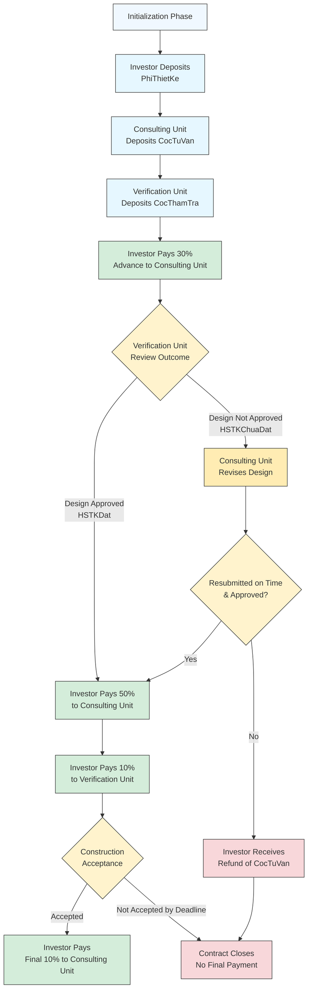

# Product Sale with Delivery, Fees, and Dispute Resolution in E-comerce platform

### **Title: Product Sale with Delivery, Fees, and Dispute Resolution**

#### **Overview:**

This contract outlines a complex product sales process involving three parties: the **Buyer**, the **Seller**, and the **Shipping Company**, overseen and mediated by an intermediary **Platform**. The participating parties will execute deposits, pay various fees (delivery, platform, dispute), confirm delivery, and handle disputes in case of issues with product quality or delivery.

**Transaction Steps (Process Summary):**

1\.     **Buyer** sends the product payment (`ProductMoney`).

2\.     **Buyer** then sends their respective `ShippingFee` and `DisputeFee`.

3\.     **Seller** sequentially sends their: `PlatformFee`, `ShippingFee`, and `DisputeFee`.

4\.     **Shipping Company** deposits the `ProductCollateral` (guarantee amount) and submits their `DisputeFee`.

5\.     **Buyer** confirms whether they have received the goods:

o   **If received:**

§  Pays the `ShippingFee_of_Buyer` to the **Shipping Company**.

§  **Buyer** confirms product quality:

§  **If quality is satisfactory:** **Seller** receives `ProductMoney`, **Platform** receives `PlatformFee`.

§  **If quality is substandard:** The **Platform** intervenes for arbitration.

6\.     **If Buyer does NOT confirm receipt:**

o   **Seller** confirms that the goods were shipped.

o   **Platform** verifies evidence provided by the **Seller** and **Shipping Company**.

o   Depending on the outcome:

§  **If evidence is valid:** Funds are distributed according to obligations (as described above).

§  **If evidence is lacking:** The **Shipping Company** must compensate the **Seller** with the `ProductCollateral` and forfeit their dispute fee.

7\.     At all steps, if a party fails to act within the stipulated deadlines, the contract **Closes** after each specified time parameter (`TimeParam`).

**Roles Involved:**

·        **Buyer:** The purchaser, responsible for the main payment and confirming product quality.

·        **Seller:** The vendor, pays platform, delivery, and dispute fees, and provides proof of delivery.

·        **Shipping Company:** The delivery party, responsible for shipping and providing proof, may have collateral deducted for violations.

·        **Platform:** The intermediary platform handling disputes, verifying evidence, and arbitrating.

**Dispute & Arbitration Logic:**

·        If a product complaint arises, the **Platform** is the sole authority for arbitration.

·        If the **Platform** confirms the goods are substandard:

o   The **Shipping Company** may forfeit their collateral.

o   Dispute fees are allocated to the **Platform**.

·        If the **Platform** rules the **Shipping Company** performed well:

o   The **Seller** still receives the product payment.

o   The **Buyer** forfeits their dispute fee.

·        If the **Platform** rejects evidence from the **Seller** or **Shipping Company**:

o   The non-compliant party(s) will forfeit their respective collateral and dispute fees.

Contract flow chart

<figure><figcaption></figcaption></figure>

### Contract in blocky format

Fully marlowe code please visit here [Marlowe playground](https://tinyurl.com/u2n6vzv7) (Note: Since the original URL of the Marlowe Playground is very long, I have shortened it.)

<figure><figcaption></figcaption></figure>

<figure><figcaption></figcaption></figure>
