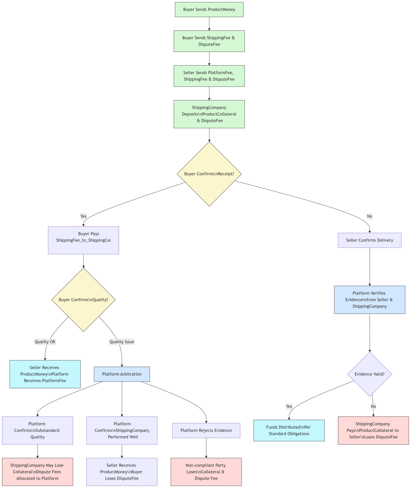

# Template No1: Product Sale with Delivery, Fees, and Dispute Resolution in E-comerce platform

## **Title: Product Sale with Delivery, Fees, and Dispute Resolution**

### **Overview:**

This contract outlines a complex product sales process involving three parties: the **Buyer**, the **Seller**, and the **Shipping Company**, overseen and mediated by an intermediary **Platform**. The participating parties will execute deposits, pay various fees (delivery, platform, dispute), confirm delivery, and handle disputes in case of issues with product quality or delivery.

### **Transaction Steps (Process Summary):**

1\.     **Buyer** sends the product payment (`ProductMoney`).

2\.     **Buyer** then sends their respective `ShippingFee` and `DisputeFee`.

3\.     **Seller** sequentially sends their: `PlatformFee`, `ShippingFee`, and `DisputeFee`.

4\.     **Shipping Company** deposits the `ProductCollateral` (guarantee amount) and submits their `DisputeFee`.

5\.     **Buyer** confirms whether they have received the goods:

o   **If received:**

&#x20; \- Pays the `ShippingFee_of_Buyer` to the **Shipping Company**.

&#x20; \- **Buyer** confirms product quality:

&#x20; \-  **If quality is satisfactory:** **Seller** receives `ProductMoney`, **Platform** receives `PlatformFee`.

&#x20; \- **If quality is substandard:** The **Platform** intervenes for arbitration.

6\.     **If Buyer does NOT confirm receipt:**

o   **Seller** confirms that the goods were shipped.

o   **Platform** verifies evidence provided by the **Seller** and **Shipping Company**.

o   Depending on the outcome:

&#x20;\-  **If evidence is valid:** Funds are distributed according to obligations (as described above).

&#x20;\-  **If evidence is lacking:** The **Shipping Company** must compensate the **Seller** with the `ProductCollateral` and forfeit their dispute fee.

7\.     At all steps, if a party fails to act within the stipulated deadlines, the contract **Closes** after each specified time parameter (`TimeParam`).


### **Roles Involved:**

·        **Buyer:** The purchaser, responsible for the main payment and confirming product quality.

·        **Seller:** The vendor, pays platform, delivery, and dispute fees, and provides proof of delivery.

·        **Shipping Company:** The delivery party, responsible for shipping and providing proof, may have collateral deducted for violations.

·        **Platform:** The intermediary platform handling disputes, verifying evidence, and arbitrating.


### **Dispute & Arbitration Logic:**

·        If a product complaint arises, the **Platform** is the sole authority for arbitration.

·        If the **Platform** confirms the goods are substandard:

o   The **Shipping Company** may forfeit their collateral.

o   Dispute fees are allocated to the **Platform**.

·        If the **Platform** rules the **Shipping Company** performed well:

o   The **Seller** still receives the product payment.

o   The **Buyer** forfeits their dispute fee.

·        If the **Platform** rejects evidence from the **Seller** or **Shipping Company**:

o   The non-compliant party(s) will forfeit their respective collateral and dispute fees.


### Contract flow chart

<figure><figcaption></figcaption></figure>

### Contract in blocky format

Fully marlowe code please visit here [Marlowe playground](https://tinyurl.com/u2n6vzv7) (Note: Since the original URL of the Marlowe Playground is very long, I have shortened it.)


<figure><figcaption></figcaption></figure>

<figure><figcaption></figcaption></figure>

### Contract in Marlowe code

```haskell
When
    [Case
        (Deposit
            (Role "Buyer")
            (Role "Buyer")
            (Token "" "")
            (ConstantParam "ProductMoney")
        )
        (Let
            "ShippingFee_of_Buyer"
            (DivValue
                (ConstantParam "ProductMoney")
                (Constant 100)
            )
            (Let
                "DisputeFee_of_Buyer"
                (DivValue
                    (MulValue
                        (ConstantParam "ProductMoney")
                        (Constant 5)
                    )
                    (Constant 100)
                )
                (Let
                    "PlatformFee"
                    (DivValue
                        (MulValue
                            (ConstantParam "ProductMoney")
                            (Constant 2)
                        )
                        (Constant 100)
                    )
                    (Let
                        "ShippingFee_of_Seller"
                        (DivValue
                            (ConstantParam "ProductMoney")
                            (Constant 100)
                        )
                        (Let
                            "DisputeFee_of_Seller"
                            (DivValue
                                (MulValue
                                    (ConstantParam "ProductMoney")
                                    (Constant 5)
                                )
                                (Constant 100)
                            )
                            (Let
                                "ProductCollateral"
                                (ConstantParam "ProductMoney")
                                (Let
                                    "DisputeFee_of_ShippingCompany"
                                    (DivValue
                                        (MulValue
                                            (ConstantParam "ProductMoney")
                                            (Constant 5)
                                        )
                                        (Constant 100)
                                    )
                                    (When
                                        [Case
                                            (Deposit
                                                (Role "Buyer")
                                                (Role "Buyer")
                                                (Token "" "")
                                                (UseValue "ShippingFee_of_Buyer")
                                            )
                                            (When
                                                [Case
                                                    (Deposit
                                                        (Role "Buyer")
                                                        (Role "Buyer")
                                                        (Token "" "")
                                                        (UseValue "DisputeFee_of_Buyer")
                                                    )
                                                    (When
                                                        [Case
                                                            (Deposit
                                                                (Role "Seller")
                                                                (Role "Seller")
                                                                (Token "" "")
                                                                (UseValue "PlatformFee")
                                                            )
                                                            (When
                                                                [Case
                                                                    (Deposit
                                                                        (Role "Seller")
                                                                        (Role "Seller")
                                                                        (Token "" "")
                                                                        (UseValue "ShippingFee_of_Seller")
                                                                    )
                                                                    (When
                                                                        [Case
                                                                            (Deposit
                                                                                (Role "Seller")
                                                                                (Role "Seller")
                                                                                (Token "" "")
                                                                                (UseValue "DisputeFee_of_Seller")
                                                                            )
                                                                            (When
                                                                                [Case
                                                                                    (Deposit
                                                                                        (Role "ShippingCompany")
                                                                                        (Role "ShippingCompany")
                                                                                        (Token "" "")
                                                                                        (UseValue "ProductCollateral")
                                                                                    )
                                                                                    (When
                                                                                        [Case
                                                                                            (Deposit
                                                                                                (Role "ShippingCompany")
                                                                                                (Role "ShippingCompany")
                                                                                                (Token "" "")
                                                                                                (UseValue "DisputeFee_of_ShippingCompany")
                                                                                            )
                                                                                            (When
                                                                                                [Case
                                                                                                    (Choice
                                                                                                        (ChoiceId
                                                                                                            "Buyer received?"
                                                                                                            (Role "Buyer")
                                                                                                        )
                                                                                                        [Bound 0 1]
                                                                                                    )
                                                                                                    (If
                                                                                                        (ValueEQ
                                                                                                            (ChoiceValue
                                                                                                                (ChoiceId
                                                                                                                    "Buyer received?"
                                                                                                                    (Role "Buyer")
                                                                                                                ))
                                                                                                            (Constant 1)
                                                                                                        )
                                                                                                        (Pay
                                                                                                            (Role "Buyer")
                                                                                                            (Party (Role "ShippingCompany"))
                                                                                                            (Token "" "")
                                                                                                            (UseValue "ShippingFee_of_Buyer")
                                                                                                            (When
                                                                                                                [Case
                                                                                                                    (Choice
                                                                                                                        (ChoiceId
                                                                                                                            "Are the goods of quality?"
                                                                                                                            (Role "Buyer")
                                                                                                                        )
                                                                                                                        [Bound 0 1]
                                                                                                                    )
                                                                                                                    (If
                                                                                                                        (ValueEQ
                                                                                                                            (ChoiceValue
                                                                                                                                (ChoiceId
                                                                                                                                    "Are the goods of quality?"
                                                                                                                                    (Role "Buyer")
                                                                                                                                ))
                                                                                                                            (Constant 1)
                                                                                                                        )
                                                                                                                        (Pay
                                                                                                                            (Role "Buyer")
                                                                                                                            (Party (Role "Seller"))
                                                                                                                            (Token "" "")
                                                                                                                            (ConstantParam "ProductMoney")
                                                                                                                            (Pay
                                                                                                                                (Role "Seller")
                                                                                                                                (Party (Role "Platform"))
                                                                                                                                (Token "" "")
                                                                                                                                (UseValue "PlatformFee")
                                                                                                                                Close 
                                                                                                                            )
                                                                                                                        )
                                                                                                                        (When
                                                                                                                            [Case
                                                                                                                                (Choice
                                                                                                                                    (ChoiceId
                                                                                                                                        "Arbitration on goods' quality assurance from the Seller"
                                                                                                                                        (Role "Platform")
                                                                                                                                    )
                                                                                                                                    [Bound 0 1]
                                                                                                                                )
                                                                                                                                (If
                                                                                                                                    (ValueEQ
                                                                                                                                        (ChoiceValue
                                                                                                                                            (ChoiceId
                                                                                                                                                "Arbitration on goods' quality assurance from the Seller"
                                                                                                                                                (Role "Platform")
                                                                                                                                            ))
                                                                                                                                        (Constant 1)
                                                                                                                                    )
                                                                                                                                    (When
                                                                                                                                        [Case
                                                                                                                                            (Choice
                                                                                                                                                (ChoiceId
                                                                                                                                                    "Is the shipping company delivering well?"
                                                                                                                                                    (Role "Platform")
                                                                                                                                                )
                                                                                                                                                [Bound 0 1]
                                                                                                                                            )
                                                                                                                                            (If
                                                                                                                                                (ValueEQ
                                                                                                                                                    (ChoiceValue
                                                                                                                                                        (ChoiceId
                                                                                                                                                            "Is the shipping company delivering well?"
                                                                                                                                                            (Role "Platform")
                                                                                                                                                        ))
                                                                                                                                                    (Constant 1)
                                                                                                                                                )
                                                                                                                                                (Pay
                                                                                                                                                    (Role "Buyer")
                                                                                                                                                    (Party (Role "Seller"))
                                                                                                                                                    (Token "" "")
                                                                                                                                                    (ConstantParam "ProductMoney")
                                                                                                                                                    (Pay
                                                                                                                                                        (Role "Seller")
                                                                                                                                                        (Party (Role "Platform"))
                                                                                                                                                        (Token "" "")
                                                                                                                                                        (UseValue "PlatformFee")
                                                                                                                                                        (Pay
                                                                                                                                                            (Role "Buyer")
                                                                                                                                                            (Party (Role "Platform"))
                                                                                                                                                            (Token "" "")
                                                                                                                                                            (UseValue "DisputeFee_of_Buyer")
                                                                                                                                                            Close 
                                                                                                                                                        )
                                                                                                                                                    )
                                                                                                                                                )
                                                                                                                                                (Pay
                                                                                                                                                    (Role "ShippingCompany")
                                                                                                                                                    (Party (Role "Seller"))
                                                                                                                                                    (Token "" "")
                                                                                                                                                    (UseValue "ProductCollateral")
                                                                                                                                                    (Pay
                                                                                                                                                        (Role "Seller")
                                                                                                                                                        (Party (Role "Platform"))
                                                                                                                                                        (Token "" "")
                                                                                                                                                        (UseValue "PlatformFee")
                                                                                                                                                        (Pay
                                                                                                                                                            (Role "ShippingCompany")
                                                                                                                                                            (Party (Role "Platform"))
                                                                                                                                                            (Token "" "")
                                                                                                                                                            (UseValue "DisputeFee_of_ShippingCompany")
                                                                                                                                                            Close 
                                                                                                                                                        )
                                                                                                                                                    )
                                                                                                                                                )
                                                                                                                                            )]
                                                                                                                                        (TimeParam "12.Time_Is the shipping company delivering well?")
                                                                                                                                        Close 
                                                                                                                                    )
                                                                                                                                    (Pay
                                                                                                                                        (Role "Seller")
                                                                                                                                        (Party (Role "ShippingCompany"))
                                                                                                                                        (Token "" "")
                                                                                                                                        (UseValue "ShippingFee_of_Seller")
                                                                                                                                        (Pay
                                                                                                                                            (Role "Seller")
                                                                                                                                            (Party (Role "Platform"))
                                                                                                                                            (Token "" "")
                                                                                                                                            (UseValue "PlatformFee")
                                                                                                                                            (Pay
                                                                                                                                                (Role "Seller")
                                                                                                                                                (Party (Role "Platform"))
                                                                                                                                                (Token "" "")
                                                                                                                                                (UseValue "DisputeFee_of_Seller")
                                                                                                                                                Close 
                                                                                                                                            )
                                                                                                                                        )
                                                                                                                                    )
                                                                                                                                )]
                                                                                                                            (TimeParam "11.Time_Arbitration on goods' quality assurance from the Seller")
                                                                                                                            Close 
                                                                                                                        )
                                                                                                                    )]
                                                                                                                (TimeParam "10.Time_Are the goods of quality?")
                                                                                                                (Pay
                                                                                                                    (Role "Buyer")
                                                                                                                    (Party (Role "Seller"))
                                                                                                                    (Token "" "")
                                                                                                                    (ConstantParam "ProductMoney")
                                                                                                                    (Pay
                                                                                                                        (Role "Seller")
                                                                                                                        (Party (Role "Platform"))
                                                                                                                        (Token "" "")
                                                                                                                        (UseValue "PlatformFee")
                                                                                                                        Close 
                                                                                                                    )
                                                                                                                )
                                                                                                            )
                                                                                                        )
                                                                                                        (When
                                                                                                            [Case
                                                                                                                (Choice
                                                                                                                    (ChoiceId
                                                                                                                        "Has the seller delivered?"
                                                                                                                        (Role "Seller")
                                                                                                                    )
                                                                                                                    [Bound 0 1]
                                                                                                                )
                                                                                                                (If
                                                                                                                    (ValueEQ
                                                                                                                        (ChoiceValue
                                                                                                                            (ChoiceId
                                                                                                                                "Has the seller delivered?"
                                                                                                                                (Role "Seller")
                                                                                                                            ))
                                                                                                                        (Constant 1)
                                                                                                                    )
                                                                                                                    (When
                                                                                                                        [Case
                                                                                                                            (Choice
                                                                                                                                (ChoiceId
                                                                                                                                    "Has the seller provided delivery proof?"
                                                                                                                                    (Role "Platform")
                                                                                                                                )
                                                                                                                                [Bound 0 1]
                                                                                                                            )
                                                                                                                            (If
                                                                                                                                (ValueEQ
                                                                                                                                    (ChoiceValue
                                                                                                                                        (ChoiceId
                                                                                                                                            "Has the seller provided delivery proof?"
                                                                                                                                            (Role "Platform")
                                                                                                                                        ))
                                                                                                                                    (Constant 1)
                                                                                                                                )
                                                                                                                                (When
                                                                                                                                    [Case
                                                                                                                                        (Choice
                                                                                                                                            (ChoiceId
                                                                                                                                                "Has the shipping company provided delivery proof?"
                                                                                                                                                (Role "Platform")
                                                                                                                                            )
                                                                                                                                            [Bound 0 1]
                                                                                                                                        )
                                                                                                                                        (If
                                                                                                                                            (ValueEQ
                                                                                                                                                (ChoiceValue
                                                                                                                                                    (ChoiceId
                                                                                                                                                        "Has the shipping company provided delivery proof?"
                                                                                                                                                        (Role "Platform")
                                                                                                                                                    ))
                                                                                                                                                (Constant 1)
                                                                                                                                            )
                                                                                                                                            (Pay
                                                                                                                                                (Role "Buyer")
                                                                                                                                                (Party (Role "ShippingCompany"))
                                                                                                                                                (Token "" "")
                                                                                                                                                (UseValue "ShippingFee_of_Buyer")
                                                                                                                                                (Pay
                                                                                                                                                    (Role "Buyer")
                                                                                                                                                    (Party (Role "Seller"))
                                                                                                                                                    (Token "" "")
                                                                                                                                                    (ConstantParam "ProductMoney")
                                                                                                                                                    (Pay
                                                                                                                                                        (Role "Seller")
                                                                                                                                                        (Party (Role "Platform"))
                                                                                                                                                        (Token "" "")
                                                                                                                                                        (UseValue "PlatformFee")
                                                                                                                                                        (Pay
                                                                                                                                                            (Role "Buyer")
                                                                                                                                                            (Party (Role "Platform"))
                                                                                                                                                            (Token "" "")
                                                                                                                                                            (UseValue "DisputeFee_of_Buyer")
                                                                                                                                                            Close 
                                                                                                                                                        )
                                                                                                                                                    )
                                                                                                                                                )
                                                                                                                                            )
                                                                                                                                            (Pay
                                                                                                                                                (Role "ShippingCompany")
                                                                                                                                                (Party (Role "Seller"))
                                                                                                                                                (Token "" "")
                                                                                                                                                (UseValue "ProductCollateral")
                                                                                                                                                (Pay
                                                                                                                                                    (Role "Seller")
                                                                                                                                                    (Party (Role "Platform"))
                                                                                                                                                    (Token "" "")
                                                                                                                                                    (UseValue "PlatformFee")
                                                                                                                                                    (Pay
                                                                                                                                                        (Role "ShippingCompany")
                                                                                                                                                        (Party (Role "Platform"))
                                                                                                                                                        (Token "" "")
                                                                                                                                                        (UseValue "DisputeFee_of_ShippingCompany")
                                                                                                                                                        Close 
                                                                                                                                                    )
                                                                                                                                                )
                                                                                                                                            )
                                                                                                                                        )]
                                                                                                                                    (TimeParam "12.Time_Has the shipping company provided delivery proof?")
                                                                                                                                    Close 
                                                                                                                                )
                                                                                                                                (Pay
                                                                                                                                    (Role "Seller")
                                                                                                                                    (Party (Role "Platform"))
                                                                                                                                    (Token "" "")
                                                                                                                                    (UseValue "DisputeFee_of_Seller")
                                                                                                                                    (Pay
                                                                                                                                        (Role "Seller")
                                                                                                                                        (Party (Role "ShippingCompany"))
                                                                                                                                        (Token "" "")
                                                                                                                                        (UseValue "ShippingFee_of_Seller")
                                                                                                                                        Close 
                                                                                                                                    )
                                                                                                                                )
                                                                                                                            )]
                                                                                                                        (TimeParam "11.Time_Has the seller provided delivery proof?")
                                                                                                                        Close 
                                                                                                                    )
                                                                                                                    Close 
                                                                                                                )]
                                                                                                            (TimeParam "10.Time_Has the seller delivered?")
                                                                                                            Close 
                                                                                                        )
                                                                                                    )]
                                                                                                (TimeParam "9.Time_Buyer received?")
                                                                                                (Pay
                                                                                                    (Role "Buyer")
                                                                                                    (Party (Role "ShippingCompany"))
                                                                                                    (Token "" "")
                                                                                                    (UseValue "ShippingFee_of_Buyer")
                                                                                                    (Pay
                                                                                                        (Role "Buyer")
                                                                                                        (Party (Role "Seller"))
                                                                                                        (Token "" "")
                                                                                                        (ConstantParam "ProductMoney")
                                                                                                        (Pay
                                                                                                            (Role "Seller")
                                                                                                            (Party (Role "Platform"))
                                                                                                            (Token "" "")
                                                                                                            (UseValue "PlatformFee")
                                                                                                            Close 
                                                                                                        )
                                                                                                    )
                                                                                                )
                                                                                            )]
                                                                                        (TimeParam "8.ShippingCompany's Dispute fee deadline")
                                                                                        Close 
                                                                                    )]
                                                                                (TimeParam "7.ShippingCompany's ProductCollateral deadline")
                                                                                Close 
                                                                            )]
                                                                        (TimeParam "6.Seller's Dispute fee deadline")
                                                                        Close 
                                                                    )]
                                                                (TimeParam "5.Seller's Shipping fee deadline")
                                                                Close 
                                                            )]
                                                        (TimeParam "4.Seller's Platform fee deadline")
                                                        Close 
                                                    )]
                                                (TimeParam "3.Buyer's Dispute fee deadline")
                                                Close 
                                            )]
                                        (TimeParam "2.Buyer's Shipping fee deadline")
                                        Close 
                                    )
                                )
                            )
                        )
                    )
                )
            )
        )]
    (TimeParam "1.Buyer's Product Money deadline")
    Close 
```
