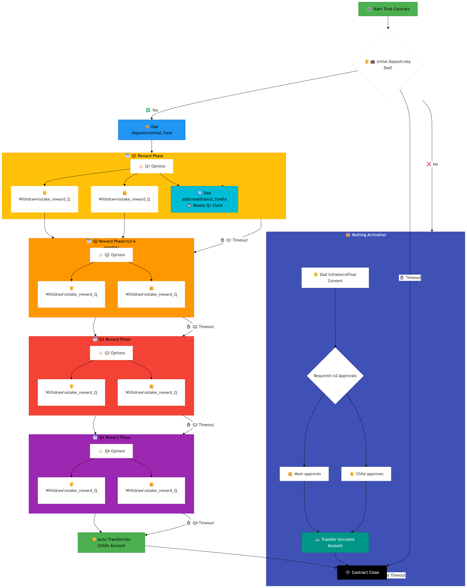
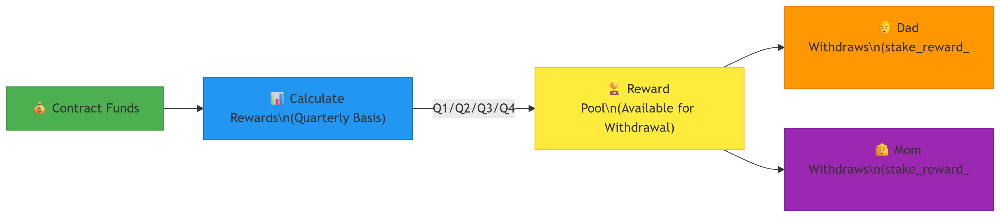
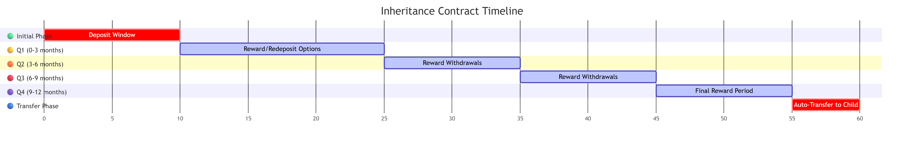
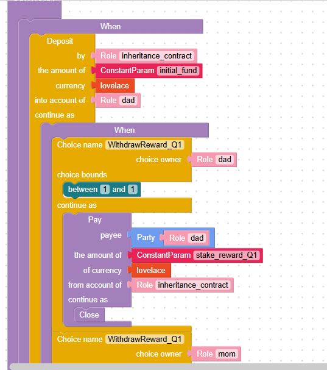
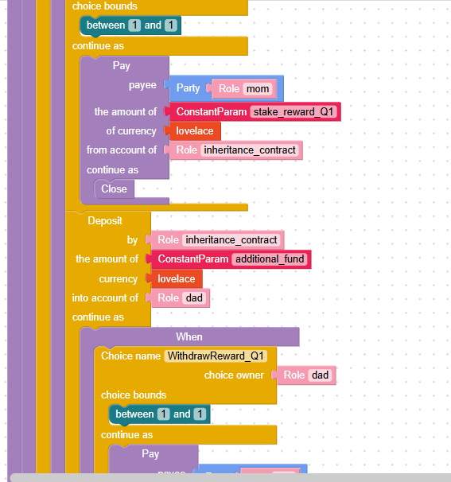

# Template No10: Inheritance Contract with Multisig wallet

## Inheritance Contract with Multisig, Stake Rewards, Auto-Fallback, and Additional Funding


This Marlowe contract implements a decentralized inheritance system involving a locked ADA fund, quarterly reward withdrawals, automatic fallback to the child, and a final unlock by multisig (2-of-3). It also allows additional deposits that reset the staking reward cycle.

***

### 📘 Overview


* 👨‍👩‍👧 **Roles**:
  * `dad`: Initial fund depositor; eligible to withdraw rewards and co-sign final unlock.
  * `mom`: Co-signer and eligible to withdraw quarterly rewards.
  * `child`: Final beneficiary after 10 years or after prolonged inactivity.
  * `joint`: A multisig wallet (2-of-3) representing any two consenting roles.

***

### 🔄 Contract Flow

#### 1. 🔐 Initial Deposit

* `dad` deposits `initial_fund` into the contract.
* Start of the first quarterly reward cycle (Q1).

#### 2. ⏳ Quarterly Reward Withdrawal (Q1 → Q4)

* Every quarter, `dad` or `mom` may choose (`Choice = 1`) to withdraw `stake_reward_Qx`.
* If no action is taken, the quarter is considered missed.

#### 3. ➕ Additional Deposit Support

* At any point, `dad` may deposit `additional_fund`.
* This **resets the reward cycle** — a new Q1 begins from that moment.

#### 4. ⚠️ Fallback to Child (Failsafe)

* If **4 consecutive quarters** pass with no reward withdrawal → all funds are transferred to `child`.

#### 5. 🔓 Final Unlock After 10 Years (Multisig 2-of-3)

* After `final_unlock_deadline`, the fund is released **only if at least two of the three roles (`dad`, `mom`, `child`)** agree.
* When `FinalConsent_X = 1` is submitted by any two, funds go to `joint` multisig wallet.

***

### 🛠️ Parameters Used

| Name                    | Description                              |
| ----------------------- | ---------------------------------------- |
| `initial_fund`          | Initial ADA deposit from `dad`           |
| `additional_fund`       | Optional top-up by `dad`                 |
| `stake_reward_Qx`       | ADA reward amount for each quarter       |
| `q1_deadline` ...       | Time limit for each quarterly decision   |
| `final_unlock_deadline` | Timestamp 10 years after initial funding |

***

### ✅ Off-Chain Logic Considerations


* Time scheduling of `q1_deadline` ... `q4_deadline` must match 3-month intervals.
* Multisig wallet `joint` must be set up to accept released funds.
* Optional UI or backend monitoring can track missed quarters.

***

### Contract flow chart

This contract design is ideal for long-term estate planning with flexibility and safety in decentralized environments.

<figure><figcaption></figcaption></figure>

### **Key Components Explained**:

**Initial Decision Point** (Green):

* Contract starts with deposit decision
* Dad must deposit initial\_fund by deposit\_deadline
* Timeout leads to immediate closure

**Quarterly Reward Phases** (Colored Sections):

* **Q1** (Yellow):
  * Withdrawals by dad/mom (stake\_reward\_Q1)
  * Dynamic re-deposit option (resets Q1 deadline)
* **Q2** (Orange):
  * Reward withdrawals only
  * Proceeds automatically after Q1 timeout
* **Q3** (Red):
  * Continuation of reward distribution
* **Q4** (Purple):
  * Final reward phase before auto-transfer
  * Automatic Inheritance Path (Green):
* **After** Q4 completion or timeout
  * Full initial\_fund transferred to child
  * Contract closes automatically
* **Multisig 2-of-3 Path** (Blue):
  * Alternative to deposit path
  * Dad initiates final consent
  * Requires approval from either mom or child
  * Funds transferred to joint account
  * Timeout closes contract without action

#### Dynamic Features:

* **Re-deposit Reset** (Teal):
  * Additional deposits reset Q1 window
  * Allows fund augmentation during Q1
* **Sequential Timeouts**:
  * Each quarter has deadline
  * Missed actions auto-proceed
* **Multi-Approval**:
  * Flexible 2-of-3 consent mechanism

### **Reward Withdrawal Logic**:

<figure><figcaption></figcaption></figure>

### **Multisig Consent Mechanism**:


<details>

<summary></summary>


</details>

**Timeline Visualization**:

<figure><figcaption></figcaption></figure>

* 🟢 Green: Initial deposit (critical path)
* 🟡 Yellow: Q1 flexible period (longest duration)
* 🟠 Orange → 🔴 Red: Progressive quarters
* 🟣 Purple: Final quarter
* 🔵 Blue: Child transfer (critical)

### Contract in blocky format <a href="#contract-in-blocky-format" id="contract-in-blocky-format"></a>

Fully marlowe code please visit here [Marlowe playground](https://tinyurl.com/b94c8tc8) (Note: Since the original URL of the Marlowe Playground is very long, I have shortened it.)

<figure><figcaption></figcaption></figure>

<figure><figcaption></figcaption></figure>

### Contract in Marlowe code <a href="#contract-in-marlowe-code" id="contract-in-marlowe-code"></a>


```rust
When
    [Case
        (Deposit
            (Role "dad")
            (Role "inheritance_contract")
            (Token "" "")
            (ConstantParam "initial_fund")
        )
        (When
            [Case
                (Choice
                    (ChoiceId
                        "WithdrawReward_Q1"
                        (Role "dad")
                    )
                    [Bound 1 1]
                )
                (Pay
                    (Role "inheritance_contract")
                    (Party (Role "dad"))
                    (Token "" "")
                    (ConstantParam "stake_reward_Q1")
                    Close 
                ), Case
                (Choice
                    (ChoiceId
                        "WithdrawReward_Q1"
                        (Role "mom")
                    )
                    [Bound 1 1]
                )
                (Pay
                    (Role "inheritance_contract")
                    (Party (Role "mom"))
                    (Token "" "")
                    (ConstantParam "stake_reward_Q1")
                    Close 
                ), Case
                (Deposit
                    (Role "dad")
                    (Role "inheritance_contract")
                    (Token "" "")
                    (ConstantParam "additional_fund")
                )
                (When
                    [Case
                        (Choice
                            (ChoiceId
                                "WithdrawReward_Q1"
                                (Role "dad")
                            )
                            [Bound 1 1]
                        )
                        (Pay
                            (Role "inheritance_contract")
                            (Party (Role "dad"))
                            (Token "" "")
                            (ConstantParam "stake_reward_Q1")
                            Close 
                        ), Case
                        (Choice
                            (ChoiceId
                                "WithdrawReward_Q1"
                                (Role "mom")
                            )
                            [Bound 1 1]
                        )
                        (Pay
                            (Role "inheritance_contract")
                            (Party (Role "mom"))
                            (Token "" "")
                            (ConstantParam "stake_reward_Q1")
                            Close 
                        )]
                    (TimeParam "q1_deadline")
                    Close 
                )]
            (TimeParam "q1_deadline")
            (When
                [Case
                    (Choice
                        (ChoiceId
                            "WithdrawReward_Q2"
                            (Role "dad")
                        )
                        [Bound 1 1]
                    )
                    (Pay
                        (Role "inheritance_contract")
                        (Party (Role "dad"))
                        (Token "" "")
                        (ConstantParam "stake_reward_Q2")
                        Close 
                    ), Case
                    (Choice
                        (ChoiceId
                            "WithdrawReward_Q2"
                            (Role "mom")
                        )
                        [Bound 1 1]
                    )
                    (Pay
                        (Role "inheritance_contract")
                        (Party (Role "mom"))
                        (Token "" "")
                        (ConstantParam "stake_reward_Q2")
                        Close 
                    )]
                (TimeParam "q2_deadline")
                (When
                    [Case
                        (Choice
                            (ChoiceId
                                "WithdrawReward_Q3"
                                (Role "dad")
                            )
                            [Bound 1 1]
                        )
                        (Pay
                            (Role "inheritance_contract")
                            (Party (Role "dad"))
                            (Token "" "")
                            (ConstantParam "stake_reward_Q3")
                            Close 
                        ), Case
                        (Choice
                            (ChoiceId
                                "WithdrawReward_Q3"
                                (Role "mom")
                            )
                            [Bound 1 1]
                        )
                        (Pay
                            (Role "inheritance_contract")
                            (Party (Role "mom"))
                            (Token "" "")
                            (ConstantParam "stake_reward_Q3")
                            Close 
                        )]
                    (TimeParam "q3_deadline")
                    (When
                        [Case
                            (Choice
                                (ChoiceId
                                    "WithdrawReward_Q4"
                                    (Role "dad")
                                )
                                [Bound 1 1]
                            )
                            (Pay
                                (Role "inheritance_contract")
                                (Party (Role "dad"))
                                (Token "" "")
                                (ConstantParam "stake_reward_Q4")
                                Close 
                            ), Case
                            (Choice
                                (ChoiceId
                                    "WithdrawReward_Q4"
                                    (Role "mom")
                                )
                                [Bound 1 1]
                            )
                            (Pay
                                (Role "inheritance_contract")
                                (Party (Role "mom"))
                                (Token "" "")
                                (ConstantParam "stake_reward_Q4")
                                Close 
                            )]
                        (TimeParam "q4_deadline")
                        (When
                            [Case
                                (Choice
                                    (ChoiceId
                                        "FinalConsent_dad"
                                        (Role "dad")
                                    )
                                    [Bound 1 1]
                                )
                                (When
                                    [Case
                                        (Choice
                                            (ChoiceId
                                                "FinalConsent_mom"
                                                (Role "mom")
                                            )
                                            [Bound 1 1]
                                        )
                                        (Pay
                                            (Role "inheritance_contract")
                                            (Party (Role "joint"))
                                            (Token "" "")
                                            (ConstantParam "initial_fund")
                                            Close 
                                        ), Case
                                        (Choice
                                            (ChoiceId
                                                "FinalConsent_child"
                                                (Role "child")
                                            )
                                            [Bound 1 1]
                                        )
                                        (Pay
                                            (Role "inheritance_contract")
                                            (Party (Role "joint"))
                                            (Token "" "")
                                            (ConstantParam "initial_fund")
                                            Close 
                                        )]
                                    (TimeParam "final_unlock_deadline")
                                    Close 
                                )]
                            (TimeParam "final_unlock_deadline")
                            (Pay
                                (Role "inheritance_contract")
                                (Party (Role "child"))
                                (Token "" "")
                                (ConstantParam "initial_fund")
                                Close 
                            )
                        )
                    )
                )
            )
        )]
    (TimeParam "deposit_deadline")
    Close 
```
