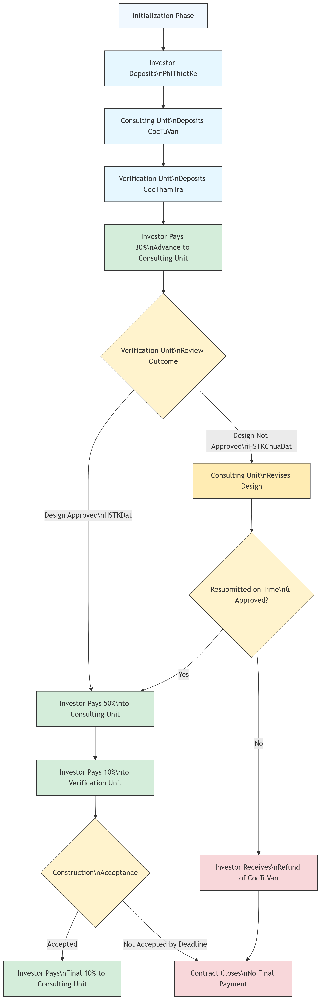
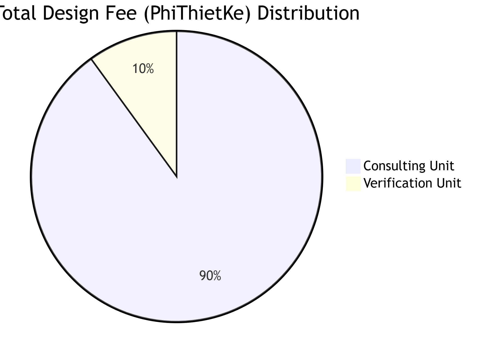
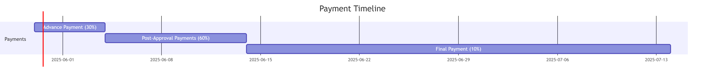

# Template no2: Contract for consulting on the design of a residential house.

## &#x20;**Contract Title: Residential Building Design Consulting Contract**

### **Overview:**

\
This contract simulates a consulting agreement for residential architectural design services involving three parties: **Investor (ChuDauTu)**, **Consulting Unit (DonViTuVan)**, and **Verification Unit (DonViThamTra)**. The process includes upfront deposits from all parties, phased payments based on design milestones, evaluation and approval of the design dossier (HSTK), and conditional payouts depending on quality and delivery. The contract ensures transparency, milestone-based commitment, and financial safeguards to align responsibilities and mitigate risks among all participants.

### &#x20;**Purpose:**

Ensure a transparent, milestone-driven cooperation process among the investor, consultant, and verifier, with clear financial commitments to protect all parties' interests.

### &#x20;**Parties Involved:**

* **Investor**: The client hiring the design consultant.
* **Consulting Unit**: Responsible for preparing the design documents (Design Dossier – _Hồ sơ thiết kế_, or HSTK).
* **Verification Unit**: Evaluates and validates the quality of the design dossier.

### &#x20;**Contract Structure & Workflow:**

1. **Investor** deposits the design fee (`PhiThietKe`) into the contract.
2. **Consulting Unit** deposits their consulting collateral (`CocTuVan`).
3. **Verification Unit** deposits their verification collateral (`CocThamTra`).
4. **Investor** pays **30% of the design fee** to the consulting unit to initiate the work.
5. **Consulting Unit** submits the design dossier (HSTK).
6. **Verification Unit** reviews the HSTK and makes a decision:
   * ✅ **If the design is approved**:
     * Investor pays an additional **50% of the design fee** to the consultant.
     * Investor pays **10% of the design fee** to the verifier.
     * Upon project completion and approval, the investor pays the remaining **10%** to the consultant.
     * Contract is closed.
   * ❌ **If the design is not approved**:
     * Consultant receives a **20% refund of their deposit**.
     * They may resubmit the revised design dossier.
     * If the revised dossier still fails after a grace period (`GiahanTienDo`), the deposit may be forfeited.

#### &#x20; **Security Mechanisms:**

* Collaterals (`CocTuVan`, `CocThamTra`) ensure that the consulting and verification parties fulfill their obligations.
* Payments are milestone-based and conditional on deliverables and quality outcomes.

#### &#x20;**Contract Completion Conditions:**

* Full payments made and all parties have fulfilled their duties.
* Or, early termination occurs if the design consistently fails to meet requirements and the consultant has no further chances to amend.

### Contract flowchart

<figure><figcaption><p>Contract flowchart</p></figcaption></figure>


<figure><figcaption></figcaption></figure>

<figure><figcaption></figcaption></figure>

### Contract in blocky and marlowe format

#### Contract in blocky format

Fully marlowe code please visit here [Marlowe playground](https://tinyurl.com/yc599pc2) (Note: Since the original URL of the Marlowe Playground is very long, I have shortened it.)

<figure><figcaption></figcaption></figure>

<figure><figcaption></figcaption></figure>

#### Contract in marlowe code

```haskell
When
    [Case
        (Deposit
            (Role "ChuDauTu")
            (Role "ChuDauTu")
            (Token "" "")
            (ConstantParam "PhiThietKe")
        )
        (When
            [Case
                (Deposit
                    (Role "DonViTuVan")
                    (Role "DonViTuVan")
                    (Token "" "")
                    (ConstantParam "CocTuVan")
                )
                (When
                    [Case
                        (Deposit
                            (Role "DonViThamTra")
                            (Role "DonViThamTra")
                            (Token "" "")
                            (ConstantParam "CocThamTra")
                        )
                        (Pay
                            (Role "ChuDauTu")
                            (Party (Role "DonViTuVan"))
                            (Token "" "")
                            (DivValue
                                (MulValue
                                    (ConstantParam "PhiThietKe")
                                    (Constant 30)
                                )
                                (Constant 100)
                            )
                            (When
                                [Case
                                    (Choice
                                        (ChoiceId
                                            "HSTKDat"
                                            (Role "DonViThamTra")
                                        )
                                        [Bound 1 1]
                                    )
                                    (Pay
                                        (Role "ChuDauTu")
                                        (Party (Role "DonViTuVan"))
                                        (Token "" "")
                                        (DivValue
                                            (MulValue
                                                (ConstantParam "PhiThietKe")
                                                (Constant 50)
                                            )
                                            (Constant 100)
                                        )
                                        (Pay
                                            (Role "ChuDauTu")
                                            (Party (Role "DonViThamTra"))
                                            (Token "" "")
                                            (DivValue
                                                (MulValue
                                                    (ConstantParam "PhiThietKe")
                                                    (Constant 10)
                                                )
                                                (Constant 100)
                                            )
                                            (When
                                                [Case
                                                    (Choice
                                                        (ChoiceId
                                                            "NghiemThuCongTrinh"
                                                            (Role "ChuDauTu")
                                                        )
                                                        [Bound 1 1]
                                                    )
                                                    (Pay
                                                        (Role "ChuDauTu")
                                                        (Party (Role "DonViTuVan"))
                                                        (Token "" "")
                                                        (DivValue
                                                            (MulValue
                                                                (ConstantParam "PhiThietKe")
                                                                (Constant 10)
                                                            )
                                                            (Constant 100)
                                                        )
                                                        Close 
                                                    )]
                                                (TimeParam "GiamSatTacGia")
                                                Close 
                                            )
                                        )
                                    ), Case
                                    (Choice
                                        (ChoiceId
                                            "HSTKChuaDat"
                                            (Role "DonViThamTra")
                                        )
                                        [Bound 0 0]
                                    )
                                    (When
                                        [Case
                                            (Choice
                                                (ChoiceId
                                                    "HSTKDat"
                                                    (Role "DonViThamTra")
                                                )
                                                [Bound 1 1]
                                            )
                                            (Pay
                                                (Role "ChuDauTu")
                                                (Party (Role "DonViTuVan"))
                                                (Token "" "")
                                                (DivValue
                                                    (MulValue
                                                        (ConstantParam "PhiThietKe")
                                                        (Constant 50)
                                                    )
                                                    (Constant 100)
                                                )
                                                (Pay
                                                    (Role "ChuDauTu")
                                                    (Party (Role "DonViThamTra"))
                                                    (Token "" "")
                                                    (DivValue
                                                        (MulValue
                                                            (ConstantParam "PhiThietKe")
                                                            (Constant 10)
                                                        )
                                                        (Constant 100)
                                                    )
                                                    (When
                                                        [Case
                                                            (Choice
                                                                (ChoiceId
                                                                    "NghiemThuCongTrinh"
                                                                    (Role "ChuDauTu")
                                                                )
                                                                [Bound 1 1]
                                                            )
                                                            (Pay
                                                                (Role "ChuDauTu")
                                                                (Party (Role "DonViTuVan"))
                                                                (Token "" "")
                                                                (DivValue
                                                                    (MulValue
                                                                        (ConstantParam "PhiThietKe")
                                                                        (Constant 10)
                                                                    )
                                                                    (Constant 100)
                                                                )
                                                                Close 
                                                            )]
                                                        (TimeParam "GiamSatTacGia")
                                                        Close 
                                                    )
                                                )
                                            )]
                                        (TimeParam "TVTKNopHSTKChinhsua")
                                        (Pay
                                            (Role "DonViTuVan")
                                            (Party (Role "ChuDauTu"))
                                            (Token "" "")
                                            (ConstantParam "CocTuVan")
                                            Close 
                                        )
                                    )]
                                (TimeParam "TVNopHSTK")
                                (Pay
                                    (Role "DonViTuVan")
                                    (Party (Role "ChuDauTu"))
                                    (Token "" "")
                                    (DivValue
                                        (MulValue
                                            (ConstantParam "CocTuVan")
                                            (Constant 20)
                                        )
                                        (Constant 100)
                                    )
                                    (When
                                        [Case
                                            (Choice
                                                (ChoiceId
                                                    "HSTKDat"
                                                    (Role "DonViThamTra")
                                                )
                                                [Bound 1 1]
                                            )
                                            (Pay
                                                (Role "ChuDauTu")
                                                (Party (Role "DonViTuVan"))
                                                (Token "" "")
                                                (DivValue
                                                    (MulValue
                                                        (ConstantParam "PhiThietKe")
                                                        (Constant 50)
                                                    )
                                                    (Constant 100)
                                                )
                                                (Pay
                                                    (Role "ChuDauTu")
                                                    (Party (Role "DonViThamTra"))
                                                    (Token "" "")
                                                    (DivValue
                                                        (MulValue
                                                            (ConstantParam "PhiThietKe")
                                                            (Constant 10)
                                                        )
                                                        (Constant 100)
                                                    )
                                                    (When
                                                        [Case
                                                            (Choice
                                                                (ChoiceId
                                                                    "NghiemThuCongTrinh"
                                                                    (Role "ChuDauTu")
                                                                )
                                                                [Bound 1 1]
                                                            )
                                                            (Pay
                                                                (Role "ChuDauTu")
                                                                (Party (Role "DonViTuVan"))
                                                                (Token "" "")
                                                                (DivValue
                                                                    (MulValue
                                                                        (ConstantParam "PhiThietKe")
                                                                        (Constant 10)
                                                                    )
                                                                    (Constant 100)
                                                                )
                                                                Close 
                                                            )]
                                                        (TimeParam "GiamSatTacGia")
                                                        Close 
                                                    )
                                                )
                                            )]
                                        (TimeParam "GiahanTienDo")
                                        (Pay
                                            (Role "DonViTuVan")
                                            (Party (Role "ChuDauTu"))
                                            (Token "" "")
                                            (ConstantParam "CocTuVan")
                                            Close 
                                        )
                                    )
                                )
                            )
                        )]
                    (TimeParam "TTNopCoc")
                    Close 
                )]
            (TimeParam "TVNopCoc")
            Close 
        )]
    (TimeParam "CĐTNopPhiThietKe")
    Close 
```
