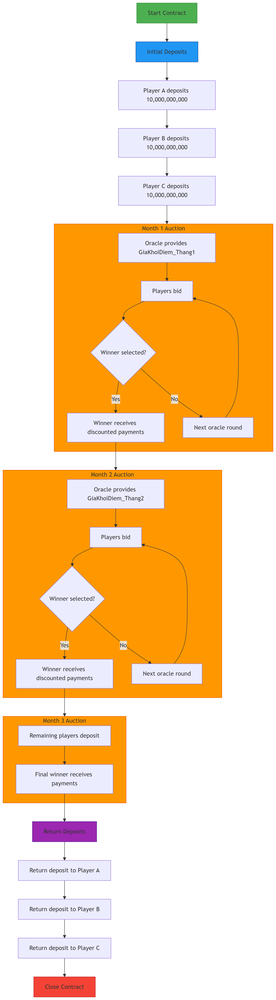
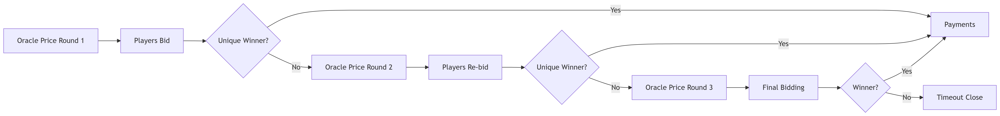

# Template No3: Rotating Savings Game with Collateral and Auction-Based Payouts

## **Title: Rotating Savings Game with Collateral and Auction-Based Payouts**

### **Overview:**

This contract simulates a 3-month rotating savings and credit association (ROSCA) game between three players: **NguoiChoiA**, **NguoiChoiB**, and **NguoiChoiC**. A centralized pool account (**QuyCocHui**) holds initial contributions from each player. Each month, players can bid (call for payout) using an auction-style mechanism with starting bid percentages provided by an **Oracle**. The winner receives the pot, while the losers for that round keep their claims for future months. The contract ensures fairness, enforces deadlines, and manages collateral returns at the end of the term.

### **Contract Steps (Process Summary):**

**Initial Setup:**

* Each player deposits an equal amount into the shared pool (**QuyCocHui**).
* Deposits are fixed: e.g., 10,000,000,000 tokens per player.

**Month 1:**

* Oracle publishes a starting bid percentage (e.g., 25–30% of total pool).
* Players submit a Choice (i.e., who calls the pot).
* If someone calls:
  * The caller (winner) receives the pot minus their bid percentage.
  * The losers’ share goes to the winner.
* If **no one calls**:
  * A second bidding round opens with a **lower starting bid** (determined by a second Oracle call).
  * Same rules apply: caller wins, others forfeit shares for the round.
  * If still no one calls → the round is skipped.

**Month 2:**

* The Month 1 winner re-deposits the full amount into the pool.
* Oracle publishes new starting bid percentage.
* Remaining players bid (excluding previous winner).
* Same logic applies: winner receives payouts, Oracle governs starting bid, second bidding round is available.
* If no one wins, process closes for Month 2.

**Month 3:**

* Final round with similar rules.
* All players who haven't yet received the pot can participate.
* After determining the winner, all players are eligible to withdraw their **initial deposits** from the **QuyCocHui** pool.

#### **Roles Involved:**

* **NguoiChoiA, B, C**: The three participants, each taking turns to call for the payout, bid against each other, and re-deposit when required.
* **QuyCocHui**: The collective pool where all initial deposits are held until the final month.
* **Oracle**: External data source that provides starting bid percentages for each month, guiding the auction floor.
* **Contract Logic**: Tracks winners per month, validates deposits, ensures fairness and enforces bid windows.

#### **Dispute & Arbitration Logic:**

* There is **no direct dispute resolution** by a mediator.
* The Oracle’s values are trusted and final.
* Bidding decisions are governed strictly by:
  * Who submits a Choice first.
  * Whether the bid amount (percentage) is within the allowed bound.
* If players do not act within **TimeParam** deadlines (e.g., submit bid, make deposits), their round is forfeited.
* At the end of 3 months, **collateral refunds** are issued if all steps were followed correctly.

#### Contract flowchart <a href="#contract-flowchart" id="contract-flowchart"></a>

<figure><figcaption><p>General contract flow</p></figcaption></figure>

\
**Key Components Explained:**


1. **Initial Deposits** (Blue):
   * All 3 players deposit 10,000,000,000 each into the common fund
2. **Monthly Auctions** (Orange):
   * **Oracle Pricing**: Determines discount rate each month
   * **Bidding**: Players compete to win the pot
   * **Winner Selection**: First player with unique bid wins
   * **Payments**: Non-winners pay winner at discounted rate
3. **Final Settlement** (Purple):
   * Remaining players make final deposits
   * Last winner receives full payments
   * Initial deposits returned to all players
4. **Timeouts** (Not shown for simplicity):
   * Strict time parameters at every step
   * Missed deadlines trigger contract closure with penalties


**Auction Detail Flow (Month 1 Example):**

<figure><figcaption></figcaption></figure>

### Contract in Blocky and Marlowe format <a href="#contract-in-blocky-and-marlowe-format" id="contract-in-blocky-and-marlowe-format"></a>


**Contract in blockly format**

CommentShare feedback on the editorFully marlowe code please visit here [Marlowe playground](https://tinyurl.com/3xmh3kuk) (Note: Since the original URL of the Marlowe Playground is very long, I have shortened it.)

<figure><figcaption></figcaption></figure>

<figure><figcaption></figcaption></figure>

**Contract in Marlowe code**

```
When
    [Case
        (Deposit
            (Address "QuyCocHui")
            (Address "NguoiChoiA")
            (Token "" "")
            (Constant 10000000000)
        )
        (When
            [Case
                (Deposit
                    (Address "QuyCocHui")
                    (Address "NguoiChoiB")
                    (Token "" "")
                    (Constant 10000000000)
                )
                (When
                    [Case
                        (Deposit
                            (Address "QuyCocHui")
                            (Address "NguoiChoiC")
                            (Token "" "")
                            (Constant 10000000000)
                        )
                        (When
                            []
                            (TimeParam "2.0.Time_Thang1_BatDau")
                            (When
                                [Case
                                    (Choice
                                        (ChoiceId
                                            "Oracle_GiaKhoiDiem_Thang1_Lan1"
                                            (Address "AddressOracle")
                                        )
                                        [Bound 25 30]
                                    )
                                    (Let
                                        "GiaKhoiDiem_Thang1"
                                        (DivValue
                                            (MulValue
                                                (Constant 10000000000)
                                                (ChoiceValue
                                                    (ChoiceId
                                                        "Oracle_GiaKhoiDiem_Thang1_Lan1"
                                                        (Address "AddressOracle")
                                                    ))
                                            )
                                            (Constant 100)
                                        )
                                        (Let
                                            "GiaKhoiDiem_Thang1"
                                            (UseValue "GiaKhoiDiem_Thang1")
                                            (When
                                                [Case
                                                    (Choice
                                                        (ChoiceId
                                                            "NguoiChoiA"
                                                            (Address "NguoiChoiA")
                                                        )
                                                        [Bound 1 1]
                                                    )
                                                    (When
                                                        [Case
                                                            (Deposit
                                                                (Address "NguoiChoiB")
                                                                (Address "NguoiChoiB")
                                                                (Token "" "")
                                                                (SubValue
                                                                    (Constant 10000000000)
                                                                    (UseValue "GiaKhoiDiem_Thang1")
                                                                )
                                                            )
                                                            (When
                                                                [Case
                                                                    (Deposit
                                                                        (Address "NguoiChoiC")
                                                                        (Address "NguoiChoiC")
                                                                        (Token "" "")
                                                                        (SubValue
                                                                            (Constant 10000000000)
                                                                            (UseValue "GiaKhoiDiem_Thang1")
                                                                        )
                                                                    )
                                                                    (Pay
                                                                        (Address "NguoiChoiB")
                                                                        (Account (Address "NguoiChoiA"))
                                                                        (Token "" "")
                                                                        (SubValue
                                                                            (Constant 10000000000)
                                                                            (UseValue "GiaKhoiDiem_Thang1")
                                                                        )
                                                                        (Pay
                                                                            (Address "NguoiChoiC")
                                                                            (Account (Address "NguoiChoiA"))
                                                                            (Token "" "")
                                                                            (SubValue
                                                                                (Constant 10000000000)
                                                                                (UseValue "GiaKhoiDiem_Thang1")
                                                                            )
                                                                            (When
                                                                                []
                                                                                (TimeParam "3.0.Time_Thang2_BatDau")
                                                                                (When
                                                                                    [Case
                                                                                        (Choice
                                                                                            (ChoiceId
                                                                                                "Oracle_GiaKhoiDiem_Thang2_Lan1"
                                                                                                (Address "AddressOracle")
                                                                                            )
                                                                                            [Bound 25 30]
                                                                                        )
                                                                                        (Let
                                                                                            "GiaKhoiDiem_Thang2"
                                                                                            (DivValue
                                                                                                (MulValue
                                                                                                    (Constant 10000000000)
                                                                                                    (ChoiceValue
                                                                                                        (ChoiceId
                                                                                                            "Oracle_GiaKhoiDiem_Thang2_Lan1"
                                                                                                            (Address "AddressOracle")
                                                                                                        ))
                                                                                                )
                                                                                                (Constant 100)
                                                                                            )
                                                                                            (Let
                                                                                                "GiaKhoiDiem_Thang2"
                                                                                                (UseValue "GiaKhoiDiem_Thang2")
                                                                                                (When
                                                                                                    [Case
                                                                                                        (Choice
                                                                                                            (ChoiceId
                                                                                                                "NguoiChoiB"
                                                                                                                (Role "NguoiChoiB")
                                                                                                            )
                                                                                                            [Bound 1 1]
                                                                                                        )
                                                                                                        (When
                                                                                                            [Case
                                                                                                                (Deposit
                                                                                                                    (Role "NguoiChoiA")
                                                                                                                    (Role "NguoiChoiA")
                                                                                                                    (Token "" "")
                                                                                                                    (Constant 10000000000)
                                                                                                                )
                                                                                                                (When
                                                                                                                    [Case
                                                                                                                        (Deposit
                                                                                                                            (Role "NguoiChoiC")
                                                                                                                            (Role "NguoiChoiC")
                                                                                                                            (Token "" "")
                                                                                                                            (SubValue
                                                                                                                                (Constant 10000000000)
                                                                                                                                (UseValue "GiaKhoiDiem_Thang2")
                                                                                                                            )
                                                                                                                        )
                                                                                                                        (Pay
                                                                                                                            (Role "NguoiChoiA")
                                                                                                                            (Party (Address "NguoiChoiB"))
                                                                                                                            (Token "" "")
                                                                                                                            (Constant 10000000000)
                                                                                                                            (Pay
                                                                                                                                (Role "NguoiChoiC")
                                                                                                                                (Party (Address "NguoiChoiB"))
                                                                                                                                (Token "" "")
                                                                                                                                (SubValue
                                                                                                                                    (Constant 10000000000)
                                                                                                                                    (UseValue "GiaKhoiDiem_Thang2")
                                                                                                                                )
                                                                                                                                (When
                                                                                                                                    []
                                                                                                                                    (TimeParam "4.0.Time_Thang3_BatDau")
                                                                                                                                    (When
                                                                                                                                        [Case
                                                                                                                                            (Deposit
                                                                                                                                                (Role "NguoiChoiA")
                                                                                                                                                (Role "NguoiChoiA")
                                                                                                                                                (Token "" "")
                                                                                                                                                (Constant 10000000000)
                                                                                                                                            )
                                                                                                                                            (When
                                                                                                                                                [Case
                                                                                                                                                    (Deposit
                                                                                                                                                        (Role "NguoiChoiB")
                                                                                                                                                        (Role "NguoiChoiB")
                                                                                                                                                        (Token "" "")
                                                                                                                                                        (Constant 10000000000)
                                                                                                                                                    )
                                                                                                                                                    (Pay
                                                                                                                                                        (Role "NguoiChoiA")
                                                                                                                                                        (Party (Address "NguoiChoiC"))
                                                                                                                                                        (Token "" "")
                                                                                                                                                        (Constant 10000000000)
                                                                                                                                                        (Pay
                                                                                                                                                            (Role "NguoiChoiB")
                                                                                                                                                            (Party (Address "NguoiChoiC"))
                                                                                                                                                            (Token "" "")
                                                                                                                                                            (Constant 10000000000)
                                                                                                                                                            (Pay
                                                                                                                                                                (Address "QuyCocHui")
                                                                                                                                                                (Party (Address "NguoiChoiA"))
                                                                                                                                                                (Token "" "")
                                                                                                                                                                (Constant 10000000000)
                                                                                                                                                                (Pay
                                                                                                                                                                    (Address "QuyCocHui")
                                                                                                                                                                    (Party (Address "NguoiChoiB"))
                                                                                                                                                                    (Token "" "")
                                                                                                                                                                    (Constant 10000000000)
                                                                                                                                                                    (Pay
                                                                                                                                                                        (Address "QuyCocHui")
                                                                                                                                                                        (Party (Address "NguoiChoiC"))
                                                                                                                                                                        (Token "" "")
                                                                                                                                                                        (Constant 10000000000)
                                                                                                                                                                        Close 
                                                                                                                                                                    )
                                                                                                                                                                )
                                                                                                                                                            )
                                                                                                                                                        )
                                                                                                                                                    )]
                                                                                                                                                (TimeParam "Time_NguoiChoiB_DongHui_Thang3")
                                                                                                                                                Close 
                                                                                                                                            )]
                                                                                                                                        (TimeParam "Time_NguoiChoiA_DongHui_Thang3")
                                                                                                                                        Close 
                                                                                                                                    )
                                                                                                                                )
                                                                                                                            )
                                                                                                                        )]
                                                                                                                    (TimeParam "Time_NguoiChoiC_DongHui_Thang2")
                                                                                                                    Close 
                                                                                                                )]
                                                                                                            (TimeParam "Time_NguoiChoiA_DongHui_Thang2")
                                                                                                            Close 
                                                                                                        ), Case
                                                                                                        (Choice
                                                                                                            (ChoiceId
                                                                                                                "NguoiChoiC"
                                                                                                                (Role "NguoiChoiC")
                                                                                                            )
                                                                                                            [Bound 1 1]
                                                                                                        )
                                                                                                        (When
                                                                                                            [Case
                                                                                                                (Deposit
                                                                                                                    (Role "NguoiChoiA")
                                                                                                                    (Role "NguoiChoiA")
                                                                                                                    (Token "" "")
                                                                                                                    (Constant 10000000000)
                                                                                                                )
                                                                                                                (When
                                                                                                                    [Case
                                                                                                                        (Deposit
                                                                                                                            (Role "NguoiChoiB")
                                                                                                                            (Role "NguoiChoiB")
                                                                                                                            (Token "" "")
                                                                                                                            (SubValue
                                                                                                                                (Constant 10000000000)
                                                                                                                                (UseValue "GiaKhoiDiem_Thang2")
                                                                                                                            )
                                                                                                                        )
                                                                                                                        (Pay
                                                                                                                            (Role "NguoiChoiA")
                                                                                                                            (Party (Address "NguoiChoiC"))
                                                                                                                            (Token "" "")
                                                                                                                            (Constant 10000000000)
                                                                                                                            (Pay
                                                                                                                                (Role "NguoiChoiB")
                                                                                                                                (Party (Address "NguoiChoiC"))
                                                                                                                                (Token "" "")
                                                                                                                                (SubValue
                                                                                                                                    (Constant 10000000000)
                                                                                                                                    (UseValue "GiaKhoiDiem_Thang2")
                                                                                                                                )
                                                                                                                                (When
                                                                                                                                    []
                                                                                                                                    (TimeParam "4.0.Time_Thang3_BatDau")
                                                                                                                                    (When
                                                                                                                                        [Case
                                                                                                                                            (Deposit
                                                                                                                                                (Role "NguoiChoiA")
                                                                                                                                                (Role "NguoiChoiA")
                                                                                                                                                (Token "" "")
                                                                                                                                                (Constant 10000000000)
                                                                                                                                            )
                                                                                                                                            (When
                                                                                                                                                [Case
                                                                                                                                                    (Deposit
                                                                                                                                                        (Role "NguoiChoiC")
                                                                                                                                                        (Role "NguoiChoiC")
                                                                                                                                                        (Token "" "")
                                                                                                                                                        (Constant 10000000000)
                                                                                                                                                    )

```

\
