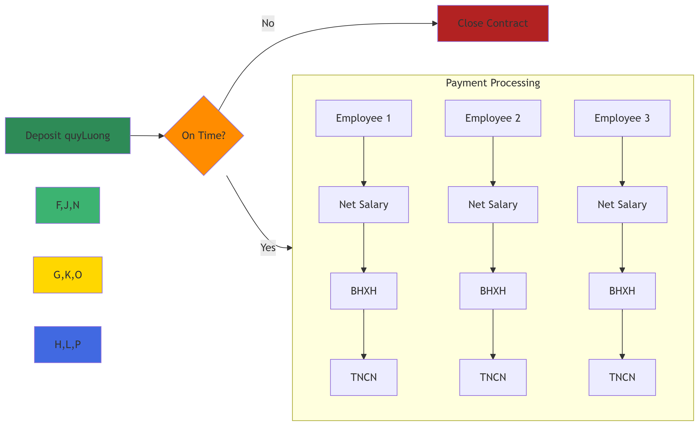
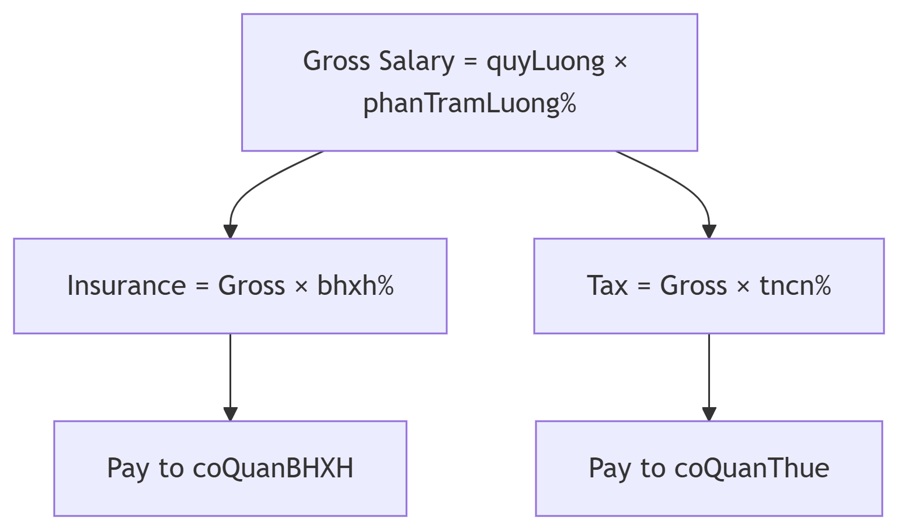

# Template No4: Advanced Payroll Distribution Contract with Tax and Social Insurance Deductions

#### **Title:** Advanced Payroll Distribution Contract with Tax and Social Insurance Deductions

***

#### **Overview:**

This contract models an automated, trustless salary payment system between a Business Owner (`chuDoanhNghiep`) and multiple Employees (`nhanVien1`, `nhanVien2`, `nhanVien3`). Each employee has individualized salary proportions and deductions. Upon deposit of the total payroll fund (`quyLuong`) by the employer, the contract distributes net salaries to employees and transfers deductions to tax (`coQuanThue`) and social insurance (`coQuanBHXH`) authorities on a defined payday (`ngayLinhLuong`). The system ensures timely, proportional, and rule-based salary execution without further intervention.

***

#### **Contract Steps (Process Summary):**

1. **Before the deadline (`nopTienLuong`)**:\
   The Business Owner must deposit the full `quyLuong` into the contract.
2. **On the payday (`ngayLinhLuong`)**, the contract automatically executes for each employee:
   * Calculates the gross salary = `quyLuong × phanTramLuong_nvX / 100`
   * Computes:
     * Social Insurance = gross × `bhxh_nvX / 100`
     * Income Tax = gross × `tncn_nvX / 100`
     * Net Salary = gross - (insurance + tax)
   * Transfers:
     * Net Salary to the employee
     * Insurance to `coQuanBHXH`
     * Tax to `coQuanThue`
3. **Final Step**:\
   Once all payments are made, the contract closes.
4. **Fallback**:\
   If the deposit is not made before `nopTienLuong`, the contract terminates without executing any payments.

***

#### **Roles Involved:**

* **`chuDoanhNghiep` (Business Owner)**\
  The employer who provides the salary fund.
* **`nhanVien1`, `nhanVien2`, `nhanVien3` (Employees)**\
  Recipients of salary with individualized salary and deduction parameters.
* **`coQuanBHXH` (Social Insurance Authority)**\
  Receives social insurance contributions per employee.
* **`coQuanThue` (Tax Authority)**\
  Receives income tax per employee.

#### **Payment Logic:**

For each employee:

```
iniCopyEditgross = quyLuong × phanTramLuong_nvX / 100
bhxh  = gross × bhxh_nvX / 100
tncn  = gross × tncn_nvX / 100
net   = gross - (bhxh + tncn)
```

Then the contract performs the following transfers:

* `Pay net → nhanVienX`
* `Pay bhxh → coQuanBHXH`
* `Pay tncn → coQuanThue`


### Contract workflow chart&#x20;

<figure><figcaption><p>Automated Payroll System with Deduction</p></figcaption></figure>

<figure><figcaption><p>Salary Calculation Flow</p></figcaption></figure>

Note:

* BHXH : Insurance
* coQuanBHXH : Insurance gorvenance department
* tncn : Income tax
* coQuanThue: Tax gorvenance department


### Contract in blockly and Marlowe&#x20;

#### Contract in blockly

Fully marlowe code please visit here [Marlowe playground](https://tinyurl.com/mpcdak9u) (Note: Since the original URL of the Marlowe Playground is very long, I have shortened it.)

<figure><figcaption></figcaption></figure>

<figure><figcaption></figcaption></figure>


#### Contract in Marlowe code


```
When
    [Case
        (Deposit
            (Role "chuDoanhNghiep")
            (Role "chuDoanhNghiep")
            (Token "" "")
            (ConstantParam "quyLuong")
        )
        (When
            []
            (TimeParam "ngayLinhLuong")
            (Pay
                (Role "chuDoanhNghiep")
                (Party (Role "nhanVien1"))
                (Token "" "")
                (DivValue
                    (MulValue
                        (DivValue
                            (MulValue
                                (ConstantParam "quyLuong")
                                (ConstantParam "phanTramLuong_nv1")
                            )
                            (Constant 100)
                        )
                        (SubValue
                            (Constant 100)
                            (AddValue
                                (ConstantParam "bhxh_nv1")
                                (ConstantParam "tncn_nv1")
                            )
                        )
                    )
                    (Constant 100)
                )
                (Pay
                    (Role "chuDoanhNghiep")
                    (Party (Role "coQuanBHXH"))
                    (Token "" "")
                    (DivValue
                        (MulValue
                            (DivValue
                                (MulValue
                                    (ConstantParam "quyLuong")
                                    (ConstantParam "phanTramLuong_nv1")
                                )
                                (Constant 100)
                            )
                            (ConstantParam "bhxh_nv1")
                        )
                        (Constant 100)
                    )
                    (Pay
                        (Role "chuDoanhNghiep")
                        (Party (Role "coQuanThue"))
                        (Token "" "")
                        (DivValue
                            (MulValue
                                (DivValue
                                    (MulValue
                                        (ConstantParam "quyLuong")
                                        (ConstantParam "phanTramLuong_nv1")
                                    )
                                    (Constant 100)
                                )
                                (ConstantParam "tncn_nv1")
                            )
                            (Constant 100)
                        )
                        (Pay
                            (Role "chuDoanhNghiep")
                            (Party (Role "nhanVien2"))
                            (Token "" "")
                            (DivValue
                                (MulValue
                                    (DivValue
                                        (MulValue
                                            (ConstantParam "quyLuong")
                                            (ConstantParam "phanTramLuong_nv2")
                                        )
                                        (Constant 100)
                                    )
                                    (SubValue
                                        (Constant 100)
                                        (AddValue
                                            (ConstantParam "bhxh_nv2")
                                            (ConstantParam "tncn_nv2")
                                        )
                                    )
                                )
                                (Constant 100)
                            )
                            (Pay
                                (Role "chuDoanhNghiep")
                                (Party (Role "coQuanBHXH"))
                                (Token "" "")
                                (DivValue
                                    (MulValue
                                        (DivValue
                                            (MulValue
                                                (ConstantParam "quyLuong")
                                                (ConstantParam "phanTramLuong_nv2")
                                            )
                                            (Constant 100)
                                        )
                                        (ConstantParam "bhxh_nv2")
                                    )
                                    (Constant 100)
                                )
                                (Pay
                                    (Role "chuDoanhNghiep")
                                    (Party (Role "coQuanThue"))
                                    (Token "" "")
                                    (DivValue
                                        (MulValue
                                            (DivValue
                                                (MulValue
                                                    (ConstantParam "quyLuong")
                                                    (ConstantParam "phanTramLuong_nv2")
                                                )
                                                (Constant 100)
                                            )
                                            (ConstantParam "tncn_nv2")
                                        )
                                        (Constant 100)
                                    )
                                    (Pay
                                        (Role "chuDoanhNghiep")
                                        (Party (Role "nhanVien3"))
                                        (Token "" "")
                                        (DivValue
                                            (MulValue
                                                (DivValue
                                                    (MulValue
                                                        (ConstantParam "quyLuong")
                                                        (ConstantParam "phanTramLuong_nv3")
                                                    )
                                                    (Constant 100)
                                                )
                                                (SubValue
                                                    (Constant 100)
                                                    (AddValue
                                                        (ConstantParam "bhxh_nv3")
                                                        (ConstantParam "tncn_nv3")
                                                    )
                                                )
                                            )
                                            (Constant 100)
                                        )
                                        (Pay
                                            (Role "chuDoanhNghiep")
                                            (Party (Role "coQuanBHXH"))
                                            (Token "" "")
                                            (DivValue
                                                (MulValue
                                                    (DivValue
                                                        (MulValue
                                                            (ConstantParam "quyLuong")
                                                            (ConstantParam "phanTramLuong_nv3")
                                                        )
                                                        (Constant 100)
                                                    )
                                                    (ConstantParam "bhxh_nv3")
                                                )
                                                (Constant 100)
                                            )
                                            (Pay
                                                (Role "chuDoanhNghiep")
                                                (Party (Role "coQuanThue"))
                                                (Token "" "")
                                                (DivValue
                                                    (MulValue
                                                        (DivValue
                                                            (MulValue
                                                                (ConstantParam "quyLuong")
                                                                (ConstantParam "phanTramLuong_nv3")
                                                            )
                                                            (Constant 100)
                                                        )
                                                        (ConstantParam "tncn_nv3")
                                                    )
                                                    (Constant 100)
                                                )
                                                Close 
                                            )
                                        )
                                    )
                                )
                            )
                        )
                    )
                )
            )
        )]
    (TimeParam "nopTienLuong")
    Close 
```
