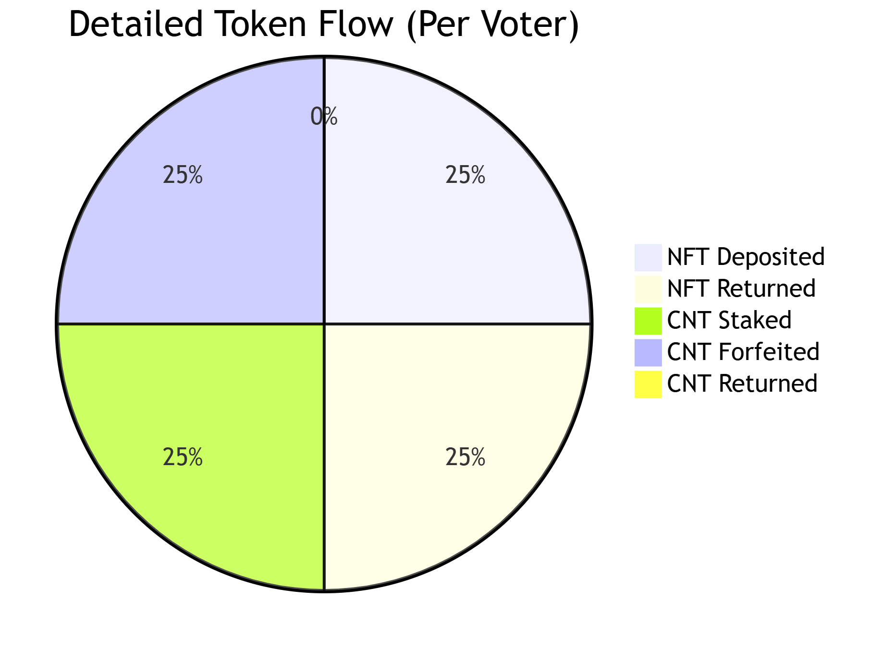

# Template No6: Charity Fund Management Contract

## Charity Fund Management Contract with Milestones, Verification & Complaint Resolution


### 🧩 Overview


This smart contract is designed to manage charitable funds **transparently and securely** via milestone-based disbursement. It ensures:

* Donors contribute once at the beginning
* Charity proposes milestone deliverables
* Independent Verifier confirms each milestone
* ProjectOperator receives funds only upon verification
* Donors can raise complaints
* Verifier resolves complaints
* Remaining funds refunded if violations occur

***

### 🎭 Roles


| Role              | Description                   |
| ----------------- | ----------------------------- |
| `Donor`           | Fund contributor              |
| `Charity`         | Project coordinator           |
| `Verifier`        | Independent milestone auditor |
| `ProjectOperator` | Implementing contractor       |

***

### 🪜 Contract Steps


<table><thead><tr><th width="73">Step</th><th>Role</th><th>Description</th></tr></thead><tbody><tr><td>1️⃣</td><td><code>Donor</code></td><td>Deposits total amount into the contract</td></tr><tr><td>2️⃣</td><td><code>Charity</code></td><td>Submits milestone 1 proposal</td></tr><tr><td>3️⃣</td><td><code>Verifier</code></td><td>Verifies milestone 1 outcome</td></tr><tr><td>4️⃣</td><td><code>ProjectOperator</code></td><td>Receives funds if milestone is verified</td></tr><tr><td>5️⃣</td><td><code>Donor</code></td><td>Optionally raises complaint</td></tr><tr><td>6️⃣</td><td><code>Verifier</code></td><td>Resolves complaint</td></tr><tr><td>🔁</td><td>...</td><td>Repeats for milestones 2 and 3</td></tr><tr><td>✅</td><td>-</td><td>Contract closes after final milestone</td></tr></tbody></table>

***

### 💰 Milestone Allocation


```
const milestone_1_amount = 5_000_000
const milestone_2_amount = 7_000_000
const milestone_3_amount = 8_000_000
const total_amount        = 20_000_000
```

***

\##**Contract flowchart**

<figure><figcaption></figcaption></figure>

## Voting Process Components

### Sequential Voting Process


1. **Strict Order**:
   * Voter1 → Voter2 → Voter3 → Voter4 → Voter5
   * Each must complete all steps before next begins
2. **4-Step Process per Voter**:

<figure><figcaption></figcaption></figure>

### Per-Voter Requirements


| Component       | Color  | Details                                                                           |
| --------------- | ------ | --------------------------------------------------------------------------------- |
| **NFT Deposit** | Purple | VotingPass1-5 tokens (policy\_id\_xyz)                                            |
| **CNT Stake**   | Blue   | Custom token (policy\_id\_token "CNT"), variable amounts (stake\_v1 to stake\_v5) |
| **Voting**      | Orange | Options: 0=Abstain, 1=Option1, 2=Option2                                          |
| **NFT Return**  | Green  | Immediate return after voting                                                     |

### Deadline Enforcement


* **Global votingDeadline** parameter
* Checked after EVERY action
* Any missed deadline → Immediate contract closure
* Visualized with red connection paths

### Token Management

<figure><figcaption></figcaption></figure>

**Key Rules**:

1. No ADA transactions (custom tokens only)
2. NFTs always returned
3. CNT stakes remain in contract
4. Supports revoting through multiple submissions

### Contract code in Blockly and Marlowe

#### Contract in Blocky

#### Contract in Marrlowe code

```rust
When
    [Case
        (Deposit
            (Role "Charity")
            (Role "Donor")
            (Token "" "")
            (ConstantParam "TotalDonation")
        )
        (When
            [Case
                (Notify TrueObs )
                (Pay
                    (Role "Charity")
                    (Party (Role "ProjectOperator"))
                    (Token "" "")
                    (ConstantParam "Payment1")
                    (When
                        [Case
                            (Choice
                                (ChoiceId
                                    "Complaint_1"
                                    (Role "Donor")
                                )
                                [Bound 0 1]
                            )
                            (If
                                (ValueEQ
                                    (ChoiceValue
                                        (ChoiceId
                                            "Complaint_1"
                                            (Role "Donor")
                                        ))
                                    (Constant 1)
                                )
                                (When
                                    [Case
                                        (Choice
                                            (ChoiceId
                                                "Verify_Complaint_1"
                                                (Role "Verifier")
                                            )
                                            [Bound 0 1]
                                        )
                                        (If
                                            (ValueEQ
                                                (ChoiceValue
                                                    (ChoiceId
                                                        "Verify_Complaint_1"
                                                        (Role "Verifier")
                                                    ))
                                                (Constant 1)
                                            )
                                            (Pay
                                                (Role "Charity")
                                                (Party (Role "Donor"))
                                                (Token "" "")
                                                (ConstantParam "Refund1")
                                                Close 
                                            )
                                            (Pay
                                                (Role "Charity")
                                                (Party (Role "ProjectOperator"))
                                                (Token "" "")
                                                (ConstantParam "Payment2")
                                                (When
                                                    [Case
                                                        (Choice
                                                            (ChoiceId
                                                                "Complaint_2"
                                                                (Role "Donor")
                                                            )
                                                            [Bound 0 1]
                                                        )
                                                        (If
                                                            (ValueEQ
                                                                (ChoiceValue
                                                                    (ChoiceId
                                                                        "Complaint_2"
                                                                        (Role "Donor")
                                                                    ))
                                                                (Constant 1)
                                                            )
                                                            (When
                                                                [Case
                                                                    (Choice
                                                                        (ChoiceId
                                                                            "Verify_Complaint_2"
                                                                            (Role "Verifier")
                                                                        )
                                                                        [Bound 0 1]
                                                                    )
                                                                    (If
                                                                        (ValueEQ
                                                                            (ChoiceValue
                                                                                (ChoiceId
                                                                                    "Verify_Complaint_2"
                                                                                    (Role "Verifier")
                                                                                ))
                                                                            (Constant 1)
                                                                        )
                                                                        (Pay
                                                                            (Role "Charity")
                                                                            (Party (Role "Donor"))
                                                                            (Token "" "")
                                                                            (ConstantParam "Refund2")
                                                                            Close 
                                                                        )
                                                                        (Pay
                                                                            (Role "Charity")
                                                                            (Party (Role "ProjectOperator"))
                                                                            (Token "" "")
                                                                            (ConstantParam "Payment3")
                                                                            Close 
                                                                        )
                                                                    )]
                                                                1750723320000
                                                                (Pay
                                                                    (Role "Charity")
                                                                    (Party (Role "Donor"))
                                                                    (Token "" "")
                                                                    (ConstantParam "Refund2")
                                                                    Close 
                                                                )
                                                            )
                                                            (Pay
                                                                (Role "Charity")
                                                                (Party (Role "ProjectOperator"))
                                                                (Token "" "")
                                                                (ConstantParam "Payment3")
                                                                Close 
                                                            )
                                                        )]
                                                    1750636920000
                                                    (Pay
                                                        (Role "Charity")
                                                        (Party (Role "Donor"))
                                                        (Token "" "")
                                                        (ConstantParam "Refund2")
                                                        Close 
                                                    )
                                                )
                                            )
                                        )]
                                    1750550520000
                                    (Pay
                                        (Role "Charity")
                                        (Party (Role "Donor"))
                                        (Token "" "")
                                        (ConstantParam "Refund1")
                                        Close 
                                    )
                                )
                                (Pay
                                    (Role "Charity")
                                    (Party (Role "ProjectOperator"))
                                    (Token "" "")
                                    (ConstantParam "Payment2")
                                    (When
                                        [Case
                                            (Choice
                                                (ChoiceId
                                                    "Complaint_2"
                                                    (Role "Donor")
                                                )
                                                [Bound 0 1]
                                            )
                                            (If
                                                (ValueEQ
                                                    (ChoiceValue
                                                        (ChoiceId
                                                            "Complaint_2"
                                                            (Role "Donor")
                                                        ))
                                                    (Constant 1)
                                                )
                                                (When
                                                    [Case
                                                        (Choice
                                                            (ChoiceId
                                                                "Verify_Complaint_2"
                                                                (Role "Verifier")
                                                            )
                                                            [Bound 0 1]
                                                        )
                                                        (If
                                                            (ValueEQ
                                                                (ChoiceValue
                                                                    (ChoiceId
                                                                        "Verify_Complaint_2"
                                                                        (Role "Verifier")
                                                                    ))
                                                                (Constant 1)
                                                            )
                                                            (Pay
                                                                (Role "Charity")
                                                                (Party (Role "Donor"))
                                                                (Token "" "")
                                                                (ConstantParam "Refund2")
                                                                Close 
                                                            )
                                                            (Pay
                                                                (Role "Charity")
                                                                (Party (Role "ProjectOperator"))
                                                                (Token "" "")
                                                                (ConstantParam "Payment3")
                                                                Close 
                                                            )
                                                        )]
                                                    1750464120000
                                                    (Pay
                                                        (Role "Charity")
                                                        (Party (Role "Donor"))
                                                        (Token "" "")
                                                        (ConstantParam "Refund2")
                                                        Close 
                                                    )
                                                )
                                                (Pay
                                                    (Role "Charity")
                                                    (Party (Role "ProjectOperator"))
                                                    (Token "" "")
                                                    (ConstantParam "Payment3")
                                                    Close 
                                                )
                                            )]
                                        1750377720000
                                        (Pay
                                            (Role "Charity")
                                            (Party (Role "Donor"))
                                            (Token "" "")
                                            (ConstantParam "Refund2")
                                            Close 
                                        )
                                    )
                                )
                            )]
                        1750337760000 Close 
                    )
                )]
            1750205040000 Close 
        )]
    1750164960000 Close 
```
