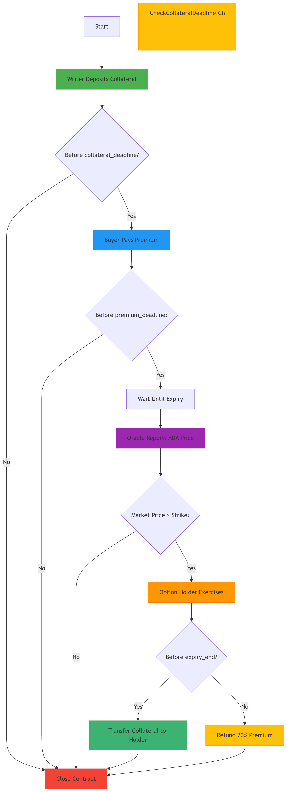
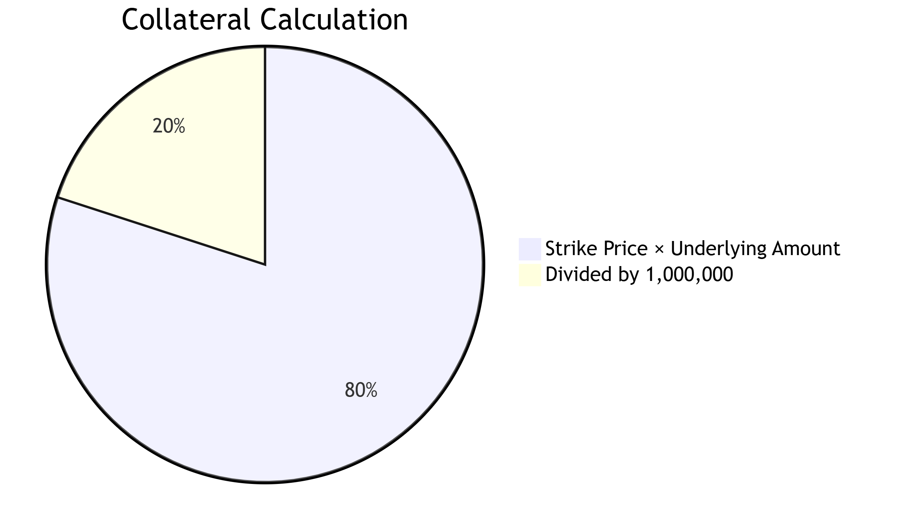
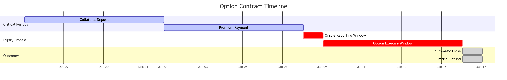
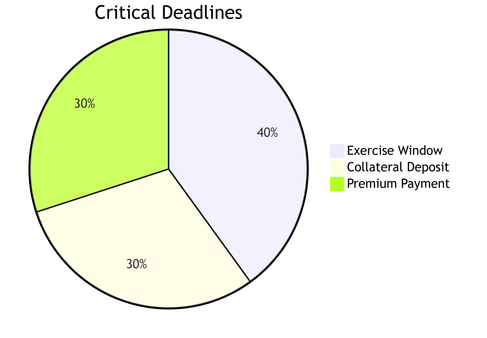
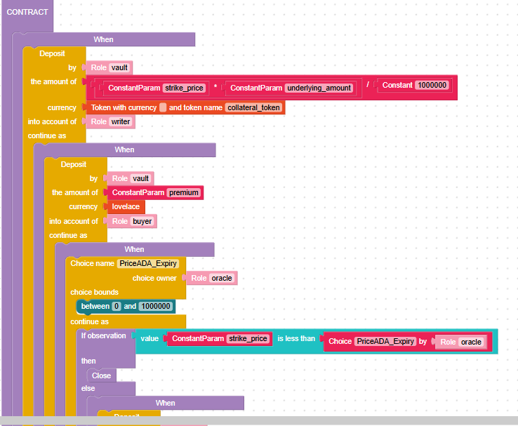
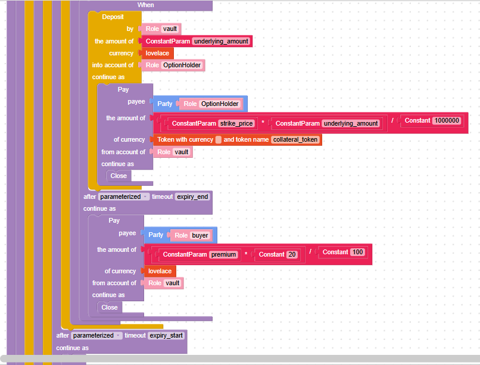

# Template No8: Put Option Contract

## Advanced Put Option Contract&#x20;


This contract models a **decentralized put option** with enhanced features such as:

* ✅ NFT-based ownership and transferability
* ✅ Oracle-based pricing validation at expiry
* ✅ Auto-close if the option is not profitable
* ✅ Refund of partial premium if unused
* ✅ Multi-token collateral (e.g., USDC, iUSD, DJED)

***

### 🧩 Roles

| Role           | Description                                                            |
| -------------- | ---------------------------------------------------------------------- |
| `writer`       | Deposits stablecoin collateral to back the option                      |
| `buyer`        | Pays the premium and receives an NFT representing the option           |
| `OptionHolder` | Whoever currently holds the Option NFT; eligible to execute the option |
| `oracle`       | Submits market price of ADA at expiry                                  |
| `vault`        | The internal Marlowe account holding funds                             |

***

### 🔄 Contract Flow

#### 1. 📥 Collateral Deposit by Writer

`writer` deposits:

```
strike_price × underlying_amount (in stablecoin)
```

This amount is held in the contract (`vault`) as payout collateral.

***

#### 2. 💰 Premium Payment by Buyer

`buyer` deposits ADA premium before `premium_deadline`.

📦 Off-chain: A unique **Option NFT** is minted and assigned to `buyer`. This NFT may be transferred before expiry.

***

#### 3. ⏳ Wait Until Exercise Window

* The option becomes exercisable between `expiry_start` and `expiry_end`.
*   During this period, the `oracle` provides:

    ```
    PriceADA_Expiry
    ```

***

#### 4. 🔍 Oracle Price Comparison

* If:

`PriceADA_Expiry >= strike_price`

→ The option is **not profitable**, so the contract **auto-closes**.

* Else: The option can be exercised.

***

#### 5. 🏹 Option Execution by NFT Holder


*   `OptionHolder` (not necessarily the buyer) deposits:

    ```
    underlying_amount (in ADA)
    ```
*   The contract pays out:

    ```
    strike_price × underlying_amount (in collateral_token)
    ```

***

#### 6. 🔁 Partial Refund to Buyer


* If the option is **not exercised by expiry\_end**,
  * The contract refunds `20%` of the premium to `buyer`.

***

### 🛠️ Parameters


| Name                  | Description                               |
| --------------------- | ----------------------------------------- |
| `strike_price`        | Target sell price of ADA                  |
| `underlying_amount`   | Amount of ADA the buyer can sell          |
| `premium`             | Fee paid to buy the option                |
| `collateral_token`    | Token paid out (e.g., USDC, DJED)         |
| `collateral_policy`   | Policy ID of the stablecoin token         |
| `expiry_start`        | Earliest time to exercise the option      |
| `expiry_end`          | Latest time to exercise the option        |
| `premium_deadline`    | Deadline to pay premium                   |
| `collateral_deadline` | Deadline for writer to deposit collateral |

***

### ✅ Example Use Case


Alice wants the right to sell 100 ADA at 0.35 USDC/ADA in the next 30 days. Bob deposits 35 USDC as collateral. Alice pays a 1 ADA premium and receives an Option NFT.

If ADA falls to 0.30 USDC, she exercises the option and gets 35 USDC. Otherwise, she receives 0.2 ADA as refund.

***

### 📦 Integration Notes


* Off-chain logic must handle NFT issuance and verification of `OptionHolder` role.
* Oracle must submit price once within `[expiry_start, expiry_end]`.
* Contract supports multiple stablecoins via parameterized policy/token.

***

## Options Contract Flow

<figure><figcaption></figcaption></figure>

### Contract Phases

#### 1. Collateral Deposit (Green)

<figure><figcaption></figcaption></figure>

**Requirements:**

* Writer deposits stablecoin collateral
* Amount = (strike\_price × underlying\_amount) / 1,000,000
* Must complete before `collateral_deadline`

#### 2. Premium Payment (Blue)


* Buyer pays premium in ADA
* System issues option NFT to buyer
* Must complete before `premium_deadline`

#### 3. Expiry Period

<figure><figcaption></figcaption></figure>

**Process:**

1. Oracle reports ADA price at `expiry_start`
2. If market price ≤ strike price: contract closes
3. If market price > strike price: enters exercise window

#### 4. Option Exercise (Orange)

**Two Paths:**


### Token Flows


| Stage    | From   | To     | Token      | Amount                 |
| -------- | ------ | ------ | ---------- | ---------------------- |
| Setup    | Writer | Vault  | Stablecoin | (strike×underlying)/1M |
| Premium  | Buyer  | Vault  | ADA        | Premium                |
| Exercise | Holder | Vault  | ADA        | Underlying Amount      |
| Payout   | Vault  | Holder | Stablecoin | (strike×underlying)/1M |
| Refund   | Vault  | Buyer  | ADA        | 20% Premium            |

### Deadline Enforcement

<figure><figcaption></figcaption></figure>

**Failure Modes:**

1. Miss collateral deadline → Immediate close
2. Miss premium deadline → Immediate close
3. Miss exercise window → Partial refund

### Example Parameters


```
{
  "collateral_policy": "stablecoin_policy",
  "collateral_token": "USDT",
  "strike_price": 3000000, // 3.00 ADA
  "underlying_amount": 10000000, // 10 ADA
  "premium": 2000000, // 2 ADA
  "collateral_deadline": "2024-12-31T23:59:59Z",
  "premium_deadline": "2025-01-07T23:59:59Z",
  "expiry_start": "2025-01-14T00:00:00Z",
  "expiry_end": "2025-01-21T23:59:59Z"
}

```


### Contract in blockly and Marlowe code <a href="#contract-in-blockly-and-marlowe-code" id="contract-in-blockly-and-marlowe-code"></a>

**Contract in blocky**

Fully marlowe code please visit here [Marlowe playground](https://tinyurl.com/345mk3s2) (Note: Since the original URL of the Marlowe Playground is very long, I have shortened it.)

<figure><figcaption></figcaption></figure>

<figure><figcaption></figcaption></figure>

Contract in Marlowe code

```rust
When
    [Case
        (Deposit
            (Role "writer")
            (Role "vault")
            (Token "" "collateral_token")
            (DivValue
                (MulValue
                    (ConstantParam "strike_price")
                    (ConstantParam "underlying_amount")
                )
                (Constant 1000000)
            )
        )
        (When
            [Case
                (Deposit
                    (Role "buyer")
                    (Role "vault")
                    (Token "" "")
                    (ConstantParam "premium")
                )
                (When
                    [Case
                        (Choice
                            (ChoiceId
                                "PriceADA_Expiry"
                                (Role "oracle")
                            )
                            [Bound 0 1000000]
                        )
                        (If
                            (ValueLT
                                (ConstantParam "strike_price")
                                (ChoiceValue
                                    (ChoiceId
                                        "PriceADA_Expiry"
                                        (Role "oracle")
                                    ))
                            )
                            Close 
                            (When
                                [Case
                                    (Deposit
                                        (Role "OptionHolder")
                                        (Role "vault")
                                        (Token "" "")
                                        (ConstantParam "underlying_amount")
                                    )
                                    (Pay
                                        (Role "vault")
                                        (Party (Role "OptionHolder"))
                                        (Token "" "collateral_token")
                                        (DivValue
                                            (MulValue
                                                (ConstantParam "strike_price")
                                                (ConstantParam "underlying_amount")
                                            )
                                            (Constant 1000000)
                                        )
                                        Close 
                                    )]
                                (TimeParam "expiry_end")
                                (Pay
                                    (Role "vault")
                                    (Party (Role "buyer"))
                                    (Token "" "")
                                    (DivValue
                                        (MulValue
                                            (ConstantParam "premium")
                                            (Constant 20)
                                        )
                                        (Constant 100)
                                    )
                                    Close 
                                )
                            )
                        )]
                    (TimeParam "expiry_start")
                    Close 
                )]
            (TimeParam "premium_deadline")
            Close 
        )]
    (TimeParam "collateral_deadline")
    Close 
```
