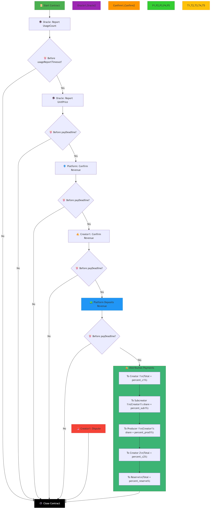
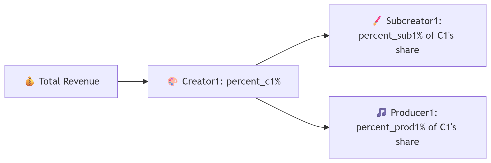
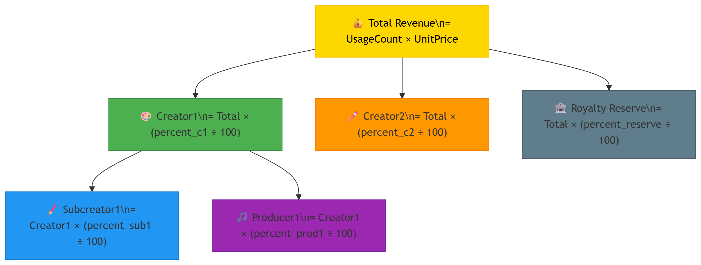
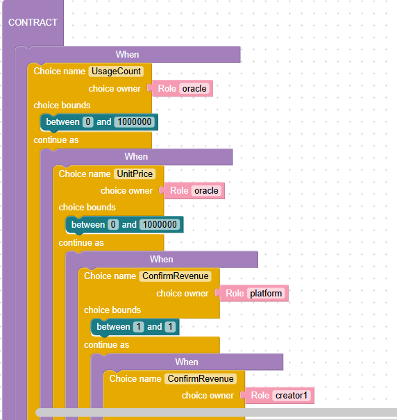
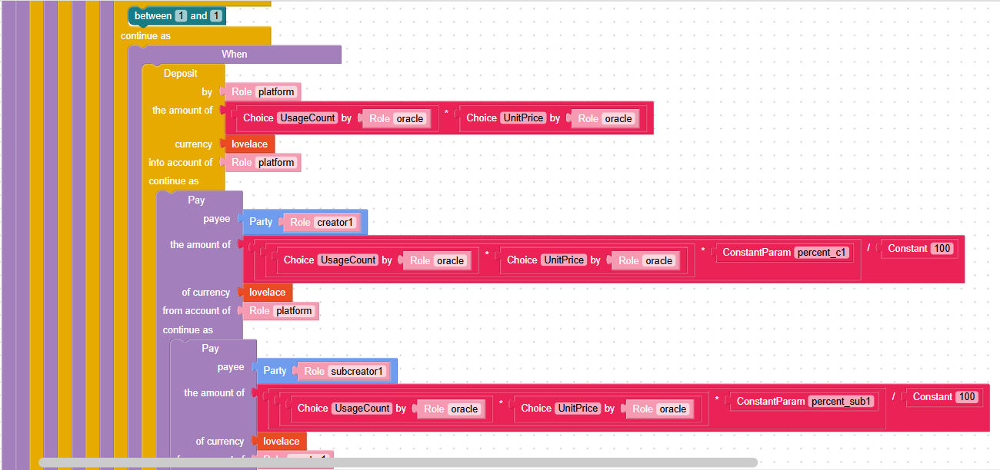

# Template No9: Royalty Distribution Contract

## Overview

This Marlowe contract automates the **fair and transparent distribution of royalties** based on the **usage of a digital asset**. It uses an **oracle** to provide usage data and pricing information, includes a **confirmation process** from both platform and creators, supports **multi-level royalty sharing**, a **reserve pool**, and includes mechanisms for **dispute resolution** and **refunds on timeout**.

> **Use Case:**\
> This model is ideal for **musicians, producers, streaming platforms**, and **digital content owners** needing **on-chain revenue distribution** tied to **verifiable usage**.

***

## 🔄 Contract Workflow


### 🧾 Step 1: Oracle Reports Usage Data

Oracle submits:

* `UsageCount`: total number of asset uses (e.g. plays, views, downloads)
* `UnitPrice`: price per usage

### ✅ Step 2: Confirmation of Revenue

Both **platform** and **creator1** must confirm revenue agreement via:

```
Choice "ConfirmRevenue" = 1
```

### 💰 Step 3: Revenue Deposit

Platform deposits:

UsageCount×UnitPrice

into the contract.

### 📤 Step 4: Multi-Level Royalty Distribution

Royalties are split as follows:

* **Creator1** receives `percent_c1%`, then splits:
  * To **Subcreator1**: `percent_sub1%` of Creator1’s share
  * To **Producer1**: `percent_prod1%` of Creator1’s share
* **Creator2** receives `percent_c2%`
* **Reserve pool** receives `percent_reserve%`

### ⚠️ Step 5: Dispute Mechanism

If Creator1 disputes the usage report **before deposit**, they may trigger:

```
Choice "Dispute" → Close
```

### ⏱️ Step 6: Refund on Timeout

If **no activity** by either `usageReportTimeout` or `payDeadline`, the contract **closes automatically**.

***

## 🔢 Parameters

| Parameter            | Description                                      |
| -------------------- | ------------------------------------------------ |
| `UsageCount`         | Submitted by oracle (number of uses)             |
| `UnitPrice`          | Submitted by oracle (price per use)              |
| `percent_c1`         | Share % for Creator1                             |
| `percent_sub1`       | Share % for Subcreator1 (under Creator1)         |
| `percent_prod1`      | Share % for Producer1 (under Creator1)           |
| `percent_c2`         | Share % for Creator2                             |
| `percent_reserve`    | Share % for reserve fund                         |
| `payDeadline`        | Final time to deposit funds                      |
| `usageReportTimeout` | Fallback timeout if no usage report is submitted |

***

✅ _This contract ensures verifiable usage-based payment, supports fair royalty splits, and provides dispute and timeout safety._

### **Contract flowchart**

<figure><figcaption></figcaption></figure>

### Key Components Explained:

\#**Oracle Reporting Phase** (Purple):

* Oracle reports UsageCount (0-1,000,000)
* Oracle reports UnitPrice (0-1,000,000)

Must complete before usageReportTimeout

\#**Confirmation Phase** (Orange):

Platform confirms revenue calculation

Creator1 confirms revenue calculation

Both must confirm before payDeadline

\#**Revenue Deposit** (Blue):

Platform deposits total revenue:

`Total Revenue = UsageCount × UnitPrice`

\#**Royalty Distribution** (Green):

<figure><figcaption></figcaption></figure>

\#**Dispute Path** (Red):

Creator1 can dispute at any time before confirmation

Immediate contract closure without payments

Acts as emergency stop

\#**Timeout Enforcement** (Yellow):

Global **`usageReportTimeout`** for oracle phase

Multiple **`payDeadline`**\` checks at each step

Missed deadlines close contract without payments

\##**Payment Calculation Details**:

<figure><figcaption></figcaption></figure>

#### Example (with hypothetical values):

If:

* UsageCount = 1,000
* UnitPrice = $0.50
* percent\_c1 = 60%
* percent\_sub1 = 20%
* percent\_prod1 = 15%
* percent\_c2 = 30%
* percent\_reserve = 10%

Calculations would flow:

1. Total = 1,000 × $0.50 = $500
2. Creator1 = $500 × 0.60 = $300
   * Subcreator1 = $300 × 0.20 = $60
   * Producer1 = $300 × 0.15 = $45
3. Creator2 = $500 × 0.30 = $150
4. Reserve = $500 × 0.10 = $50

**Timeline Visualization**:

<figure><figcaption></figcaption></figure>

**Key Features**:&#x20;

* **Multi-Party Verification:**
  * &#x20;Oracle provides usage metrics
  * Platform and creator both confirm validity
  * Prevents incorrect distributions
* **Hierarchical Royalties:**
  * Primary creator receives percentage
  * Creator can split their share with subcontractors
  * Secondary creator receives separate percentage
  * Reserve fund allocation
* **Dispute Mechanism**:
  * Creator1 can trigger immediate closure
  * Protects against incorrect revenue reporting
  * Emergency stop functionality
* **Time-Bound Execution:**
  * Strict timeouts at every phase
  * Automated closure on missed deadlines
  * Ensures timely distribution
* **Percentage-Based Allocation:**
  * All payments calculated as percentages
* **Flexible parameterization:**
  * `percent_c1`: Primary creator's share
  * `percent_sub1`: Subcreator's share of creator1's portion
  * `percent_prod1`: Producer's share of creator1's portion
  * `percent_c2`: Secondary creator's share
  * `percent_reserve`: Reserve fund percentage

### Contract in blocky format <a href="#contract-in-blocky-format" id="contract-in-blocky-format"></a>

Fully marlowe code please visit here [Marlowe playground](https://tinyurl.com/6cmhwfad) (Note: Since the original URL of the Marlowe Playground is very long, I have shortened it.)

<figure><figcaption></figcaption></figure>

<figure><figcaption></figcaption></figure>

### Contract in Marlowe code <a href="#contract-in-marlowe-code" id="contract-in-marlowe-code"></a>

```rust
When
  [ Case (Choice (ChoiceId "UsageCount" (Role "oracle")) [Bound 0 1000000])
      (When
        [ Case (Choice (ChoiceId "UnitPrice" (Role "oracle")) [Bound 0 1000000])
            (When
              [ Case (Choice (ChoiceId "ConfirmRevenue" (Role "platform")) [Bound 1 1])
                  (When
                    [ Case (Choice (ChoiceId "ConfirmRevenue" (Role "creator1")) [Bound 1 1])
                        (When
                          [ Case
                              (Deposit
                                (Role "platform")
                                (Role "platform")
                                (Token "" "")
                                (MulValue
                                  (ChoiceValue (ChoiceId "UsageCount" (Role "oracle")))
                                  (ChoiceValue (ChoiceId "UnitPrice" (Role "oracle")))
                                )
                              )
                              (Pay
                                (Role "platform")
                                (Party (Role "creator1"))
                                (Token "" "")
                                (DivValue
                                  (MulValue
                                    (MulValue
                                      (ChoiceValue (ChoiceId "UsageCount" (Role "oracle")))
                                      (ChoiceValue (ChoiceId "UnitPrice" (Role "oracle")))
                                    )
                                    (ConstantParam "percent_c1")
                                  )
                                  (Constant 100)
                                )
                                (Pay
                                  (Role "creator1")
                                  (Party (Role "subcreator1"))
                                  (Token "" "")
                                  (DivValue
                                    (MulValue
                                      (MulValue
                                        (ChoiceValue (ChoiceId "UsageCount" (Role "oracle")))
                                        (ChoiceValue (ChoiceId "UnitPrice" (Role "oracle")))
                                      )
                                      (ConstantParam "percent_sub1")
                                    )
                                    (Constant 100)
                                  )
                                  (Pay
                                    (Role "creator1")
                                    (Party (Role "producer1"))
                                    (Token "" "")
                                    (DivValue
                                      (MulValue
                                        (MulValue
                                          (ChoiceValue (ChoiceId "UsageCount" (Role "oracle")))
                                          (ChoiceValue (ChoiceId "UnitPrice" (Role "oracle")))
                                        )
                                        (ConstantParam "percent_prod1")
                                      )
                                      (Constant 100)
                                    )
                                    (Pay
                                      (Role "platform")
                                      (Party (Role "creator2"))
                                      (Token "" "")
                                      (DivValue
                                        (MulValue
                                          (MulValue
                                            (ChoiceValue (ChoiceId "UsageCount" (Role "oracle")))
                                            (ChoiceValue (ChoiceId "UnitPrice" (Role "oracle")))
                                          )
                                          (ConstantParam "percent_c2")
                                        )
                                        (Constant 100)
                                      )
                                      (Pay
                                        (Role "platform")
                                        (Party (Role "royaltyReserve"))
                                        (Token "" "")
                                        (DivValue
                                          (MulValue
                                            (MulValue
                                              (ChoiceValue (ChoiceId "UsageCount" (Role "oracle")))
                                              (ChoiceValue (ChoiceId "UnitPrice" (Role "oracle")))
                                            )
                                            (ConstantParam "percent_reserve")
                                          )
                                          (Constant 100)
                                        )
                                        Close
                                      )
                                    )
                                  )
                                )
                              )
                          ]
                          (TimeParam "payDeadline")
                          Close
                        )
                    ]
                    (TimeParam "payDeadline")
                    Close
                  )
              ]
              (TimeParam "payDeadline")
              Close
            )
        ]
        (TimeParam "payDeadline")
        Close
      )
  , Case (Choice (ChoiceId "Dispute" (Role "creator1")) [Bound 1 1])
      Close
  ]
  (TimeParam "usageReportTimeout")
  Close
```

\


