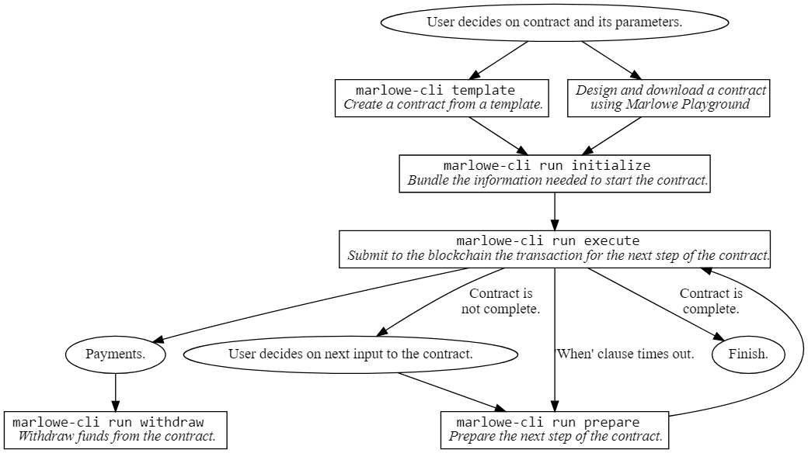

# Marlowe CLI

## Marlowe Command-Line Interface (CLI) Tool

The `marlowe-cli` tool provides several utilities for serialising Marlowe contracts to validators, datums, and redeemers. It also computes hashes and addresses. It can be used in conjunction with [`cardano-cli`](https://github.com/input-output-hk/cardano-node/blob/master/cardano-cli/README.md) to submit Marlowe transactions to the Cardano blockchain.

See the Marlowe Debugging Cookbook for troubleshooting information, or the [Marlowe CLI Pioneers Lectures](https://github.com/input-output-hk/real-world-marlowe/tree/main/archives/marlowe-cli/lectures/ReadMe.md).


### Installation

One can install `marlowe-cli` either using Nix or Cabal. Detailed instructions are available [here](https://github.com/input-output-hk/marlowe-cardano/blob/main/README.adoc).

#### Installation via Nix

NixOS and the Nix package manager are available at <[https://nixos.org/](https://nixos.org/)>.

👉 See <[https://github.com/input-output-hk/marlowe-cardano/blob/main/README.adoc#how-to-set-up-the-iohk-binary-caches](https://github.com/input-output-hk/marlowe-cardano/blob/main/README.adoc#how-to-set-up-the-iohk-binary-caches)> on how to set up binary caches for the Nix build. This will greatly speed the build process.

Once the binary caches have been set up, clone the Marlowe repository and simply enter a nix shell.

```
git clone https://github.com/input-output-hk/marlowe-cardano.git
cd marlowe-cardano
nix develop
```

```bash
marlowe-cli --version
```

```
marlowe-cli 0.0.8.0
```

#### Installation via Cabal

Cabal and GHC are available at [GHCup](https://www.haskell.org/ghcup/).

Installing directly via `cabal` and `ghc` involves lengthy compilation, but avoids the use of Nix. First ensure that Cabal 3.4 and GHC 8.10.7 are installed.

```bash
cabal --version
```

```
cabal-install version 3.4.0.0
compiled using version 3.4.1.0 of the Cabal library 
```

```bash
ghc --version
```

```
The Glorious Glasgow Haskell Compilation System, version 8.10.7
```

Clone the Marlowe repository and execute `cabal`:

```
git clone https://github.com/input-output-hk/marlowe-cardano.git
cd marlowe-cardano
cabal install exe:marlowe-cli
```

### Available Commands

```bash
marlowe-cli --help
```

```
marlowe-cli : a command-line tool for Marlowe contracts

Usage: marlowe-cli [--version] 
                   (COMMAND | COMMAND | [--alonzo-era] (COMMAND | COMMAND) | 
                     --babbage-era (COMMAND | COMMAND))

  Utilities for Marlowe.

Available options:
  -h,--help                Show this help text
  --version                Show version.
  --alonzo-era             Read and write Alonzo transactions
  --babbage-era            Read and write Babbage transactions
  --conway-era             Read and write Conway transactions

High-level commands:
  run                      Run a contract.
  template                 Create a contract from a template.
  test                     Test contracts.

Low-level commands:
  contract                 Export contract address, validator, datum, or
                           redeemer.
  input                    Create inputs to a contract.
  role                     Export role address, validator, datum, or redeemer.
  transaction              Create and submit transactions.
  util                     Miscellaneous utilities.
```

Further help is available for each subcommand:

* high-level commands
  * [`marlowe-cli run`](https://github.com/input-output-hk/marlowe-cardano/blob/main/marlowe-cli/doc/run.md)
  * [`marlowe-cli template`](https://github.com/input-output-hk/marlowe-cardano/blob/main/marlowe-cli/doc/template.md)
  * [`marlowe-cli test`](https://github.com/input-output-hk/marlowe-cardano/blob/main/marlowe-cli/doc/test.md)
* low-level commands
  * [`marlowe-cli contract`](https://github.com/input-output-hk/marlowe-cardano/blob/main/marlowe-cli/doc/contract.md)
  * [`marlowe-cli input`](https://github.com/input-output-hk/marlowe-cardano/blob/main/marlowe-cli/doc/input.md)
  * [`marlowe-cli role`](https://github.com/input-output-hk/marlowe-cardano/blob/main/marlowe-cli/doc/role.md)
  * [`marlowe-cli transaction`](https://github.com/input-output-hk/marlowe-cardano/blob/main/marlowe-cli/doc/transaction.md)
  * [`marlowe-cli util`](https://github.com/input-output-hk/marlowe-cardano/blob/main/marlowe-cli/doc/util.md)

### Workflows

Marlowe CLI supports workflows for specific use cases:

* A high-level workflow for interacting with Marlowe contracts without dealing with the underlying its Plutus mechanics.
* A low-level workflow that exposes the Plutus mechanics of Marlowe contracts.

#### High-Level Workflow

In the high-level workflow for `marlowe-cli`, the user creates a contract from a template, using Marlowe Playground, programmatically, or by hand. The user provides input at each step of contract execution. The tool manages the contract state transitions and handles the construction and submission of transactions.

<figure><figcaption></figcaption></figure>

**Examples**

* [simple contract](https://github.com/input-output-hk/real-world-marlowe/tree/main/archives/marlowe-cli/examples/simple/ReadMe.md)
* [escrow](https://github.com/input-output-hk/real-world-marlowe/tree/main/archives/marlowe-cli/examples/escrow/ReadMe.md)
* [swap](https://github.com/input-output-hk/real-world-marlowe/tree/main/archives/marlowe-cli/examples/swap/ReadMe.md)
* [zero-coupon bond](https://github.com/input-output-hk/real-world-marlowe/tree/main/archives/marlowe-cli/examples/zcb/ReadMe.md)
* [contract for differences](https://github.com/input-output-hk/real-world-marlowe/tree/main/archives/marlowe-cli/examples/cfd/ReadMe.md)
* [covered call](https://github.com/input-output-hk/real-world-marlowe/tree/main/archives/marlowe-cli/examples/coveredCall/ReadMe.md)

**Test Cases**

* [simple contract](https://github.com/input-output-hk/real-world-marlowe/tree/main/archives/marlowe-cli/examples/simple/run-test.sh)
* escrow
  * ["everything is alright"](https://github.com/input-output-hk/real-world-marlowe/tree/main/archives/marlowe-cli/xamples/escrow/run-everything-is-alright.sh)
  * ["confirm problem"](https://github.com/input-output-hk/real-world-marlowe/tree/main/archives/marlowe-cli/examples/escrow/run-confirm-problem.sh)
  * ["dismiss claim"](https://github.com/input-output-hk/real-world-marlowe/tree/main/archives/marlowe-cli/examples/escrow/run-dimiss-claim.sh)
  * ["confirm claim"](https://github.com/input-output-hk/real-world-marlowe/tree/main/archives/marlowe-cli/examples/escrow/run-confirm-claim.sh)
* [swap](https://github.com/input-output-hk/real-world-marlowe/tree/main/archives/marlowe-cli/examples/swap/run-swap.sh)
* [zero-coupon bond](https://github.com/input-output-hk/real-world-marlowe/tree/main/archives/marlowe-cli/examples/zcb/run-zcb.sh)
* [contract for differences](https://github.com/input-output-hk/real-world-marlowe/tree/main/archives/marlowe-cli/examples/cfd/run-cfd.sh)
* [covered call](https://github.com/input-output-hk/real-world-marlowe/tree/main/archives/marlowe-cli/examples/coveredCall/run-coveredCall.sh)

#### Low-Level Workflow

The `marlowe-cli` tools supports both granular and monolithic workflows for creating the files and hashes needed to submit Marlowe contracts with `cardano-cli`. The workflows only differ in how information is packaged.

**Monolithic Workflow**

The `export-marlowe` command writes a JSON file with sufficient information to run the contract on the blockchain. It contains the following information.

* Script address
* Validator hash
* Datum hash
* CBOR for Plutus script
* JSON and CBOR for datum.
* JSON and CBOR for redeemer.
* Size of the above CBOR in bytes
* Execution cost

The diagram below illusrates how the `export` command can be used in conjunction with [`jq`](https://stedolan.github.io/jq/manual/) and `cardano-cli`.

See monolithic.marlowe for an example file containing this information for a simple contract. A tutorial for this workflow is available here.

#### Granular Workflow

The `contract address`, `contract validator`, `contract datum`, and `contract redeemer` commands write the corresponding subset of information to a JSON file or to the console. These allows finer-grain access to the capabilities of the `contract marlowe` command. The diagram below illustrates how these commands can be used in conjunction with `cardano-cli`.

A tutorial for this workflow is available here.

### Automated Tests

* Tests that interact directly with the Cardano blockchain: run-nonpab-tests.sh

### Editing and Rebuilding This Documentation

Most of this documentation is edited in Jupyter notebooks, execute `nix develop --command jupyter-lab` to launch Jupyter.

Execute `make` or `./Makefile` to rebuild this documentation.
