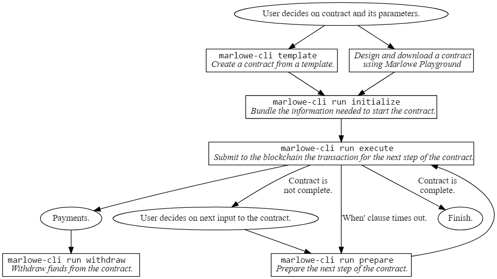

# Marlowe CLI

## Marlowe Command-Line Interface (CLI) Tool

`marlowe-cli`  là công cụ cung cấp nhiều tiện ích để tuần tự hóa các hợp đồng Marlowe thành các **validators**, **datums**, và **redeemers**. Nó cũng tính toán băm và địa chỉ. Công cụ này có thể được sử dụng cùng với `cardano-cli` để gửi các giao dịch Marlowe lên blockchain Cardano. [`cardano-cli`](https://github.com/input-output-hk/cardano-node/blob/master/cardano-cli/README.md)

Xem Sách "Hướng Dẫn Gỡ Lỗi Marlowe" để biết thông tin khắc phục sự cố, hoặc[Marlowe CLI Pioneers Lectures](https://github.com/input-output-hk/real-world-marlowe/tree/main/archives/marlowe-cli/lectures/ReadMe.md).


### Cài đặt

Người dùng có thể cài đặt `marlowe-cli` bằng cách sử dụng Nix hoặc Cabal. Hướng dẫn chi tiết có sẵn tại [đây](https://github.com/input-output-hk/marlowe-cardano/blob/main/README.adoc).

#### Cài đặt qua Nix

NixOS và gói quản lý Nix có thể xem tại 👉  <[https://nixos.org/](https://nixos.org/)>.

👉 Xem <[https://github.com/input-output-hk/marlowe-cardano/blob/main/README.adoc#how-to-set-up-the-iohk-binary-caches](https://github.com/input-output-hk/marlowe-cardano/blob/main/README.adoc#how-to-set-up-the-iohk-binary-caches)> về cách thiết lập bộ nhớ đệm nhị phân cho quá trình build bằng Nix. Điều này sẽ giúp tăng tốc đáng kể quá trình build.&#x20;

Sau khi thiết lập bộ nhớ đệm nhị phân, hãy sao chép repository của Marlowe và chỉ cần vào qua một nix shell.

```
git clone https://github.com/input-output-hk/marlowe-cardano.git
cd marlowe-cardano
nix develop
```

```bash
marlowe-cli --version
```

```
marlowe-cli 0.0.8.0
```

#### Cài đặt qua Cabal

Cabal và GHC are available at [GHCup](https://www.haskell.org/ghcup/).

Việc cài đặt trực tiếp thông qua `Cabal` và `GHC` liên quan đến quá trình biên dịch kéo dài nhưng tránh được việc sử dụng Nix. Trước tiên, hãy đảm bảo rằng Cabal 3.4 và GHC 8.10.7 đã được cài đặt

```bash
cabal --version
```

```
cabal-install version 3.4.0.0
compiled using version 3.4.1.0 of the Cabal library 
```

```bash
ghc --version
```

```
The Glorious Glasgow Haskell Compilation System, version 8.10.7
```

Nhân bản kho lưu trữ Marlowe và thực thi `cabal`:

```
git clone https://github.com/input-output-hk/marlowe-cardano.git
cd marlowe-cardano
cabal install exe:marlowe-cli
```

### Các câu lệnh marlowe-cli

```bash
marlowe-cli --help
```

```
marlowe-cli : a command-line tool for Marlowe contracts

Usage: marlowe-cli [--version] 
                   (COMMAND | COMMAND | [--alonzo-era] (COMMAND | COMMAND) | 
                     --babbage-era (COMMAND | COMMAND))

  Utilities for Marlowe.

Available options:
  -h,--help                Show this help text
  --version                Show version.
  --alonzo-era             Read and write Alonzo transactions
  --babbage-era            Read and write Babbage transactions
  --conway-era             Read and write Conway transactions

High-level commands:
  run                      Run a contract.
  template                 Create a contract from a template.
  test                     Test contracts.

Low-level commands:
  contract                 Export contract address, validator, datum, or
                           redeemer.
  input                    Create inputs to a contract.
  role                     Export role address, validator, datum, or redeemer.
  transaction              Create and submit transactions.
  util                     Miscellaneous utilities.
```

Chi tiết cho từng lệnh con:

* Các câu lệnh bậc cao (high-level)
  * [`marlowe-cli run`](https://github.com/input-output-hk/marlowe-cardano/blob/main/marlowe-cli/doc/run.md)
  * [`marlowe-cli template`](https://github.com/input-output-hk/marlowe-cardano/blob/main/marlowe-cli/doc/template.md)
  * [`marlowe-cli test`](https://github.com/input-output-hk/marlowe-cardano/blob/main/marlowe-cli/doc/test.md)
* Các câu lệnh bậc thấp (low-level)
  * [`marlowe-cli contract`](https://github.com/input-output-hk/marlowe-cardano/blob/main/marlowe-cli/doc/contract.md)
  * [`marlowe-cli input`](https://github.com/input-output-hk/marlowe-cardano/blob/main/marlowe-cli/doc/input.md)
  * [`marlowe-cli role`](https://github.com/input-output-hk/marlowe-cardano/blob/main/marlowe-cli/doc/role.md)
  * [`marlowe-cli transaction`](https://github.com/input-output-hk/marlowe-cardano/blob/main/marlowe-cli/doc/transaction.md)
  * [`marlowe-cli util`](https://github.com/input-output-hk/marlowe-cardano/blob/main/marlowe-cli/doc/util.md)

### Các luồng công việc

Marlowe CLI hỗ trợ các quy trình làm việc cho các trường hợp sử dụng cụ thể:

* Một quy trình làm việc bậc cao để tương tác với các hợp đồng Marlowe mà không cần xử lý các cơ chế `Plutus` cơ bản của nó.
* Một quy trình làm việc bậc thấp hiển lộ các cơ chế `Plutus` của các hợp đồng Marlowe.

**Luồng công việc bậc cao**

Trong quy trình làm việc bậc cao cho marlowe-cli, người dùng tạo hợp đồng từ một mẫu có sẵn, sử dụng Marlowe Playground, hoặc lập trình theo cách thủ công.&#x20;

Người dùng cung cấp đầu vào tại mỗi bước thực thi hợp đồng. Công cụ quản lý các chuyển trạng thái của hợp đồng và xử lý việc tạo và gửi các giao dịch.

<figure><figcaption></figcaption></figure>

**Hợp đồng mẫu**

* [simple contract](https://github.com/input-output-hk/real-world-marlowe/tree/main/archives/marlowe-cli/examples/simple/ReadMe.md)
* [escrow](https://github.com/input-output-hk/real-world-marlowe/tree/main/archives/marlowe-cli/examples/escrow/ReadMe.md)
* [swap](https://github.com/input-output-hk/real-world-marlowe/tree/main/archives/marlowe-cli/examples/swap/ReadMe.md)
* [zero-coupon bond](https://github.com/input-output-hk/real-world-marlowe/tree/main/archives/marlowe-cli/examples/zcb/ReadMe.md)
* [contract for differences](https://github.com/input-output-hk/real-world-marlowe/tree/main/archives/marlowe-cli/examples/cfd/ReadMe.md)
* [covered call](https://github.com/input-output-hk/real-world-marlowe/tree/main/archives/marlowe-cli/examples/coveredCall/ReadMe.md)

**Các trường hợp thử nghiệm**

* [simple contract](https://github.com/input-output-hk/real-world-marlowe/tree/main/archives/marlowe-cli/examples/simple/run-test.sh)
* escrow
  * ["everything is alright"](https://github.com/input-output-hk/real-world-marlowe/tree/main/archives/marlowe-cli/xamples/escrow/run-everything-is-alright.sh)
  * ["confirm problem"](https://github.com/input-output-hk/real-world-marlowe/tree/main/archives/marlowe-cli/examples/escrow/run-confirm-problem.sh)
  * ["dismiss claim"](https://github.com/input-output-hk/real-world-marlowe/tree/main/archives/marlowe-cli/examples/escrow/run-dimiss-claim.sh)
  * ["confirm claim"](https://github.com/input-output-hk/real-world-marlowe/tree/main/archives/marlowe-cli/examples/escrow/run-confirm-claim.sh)
* [swap](https://github.com/input-output-hk/real-world-marlowe/tree/main/archives/marlowe-cli/examples/swap/run-swap.sh)
* [zero-coupon bond](https://github.com/input-output-hk/real-world-marlowe/tree/main/archives/marlowe-cli/examples/zcb/run-zcb.sh)
* [contract for differences](https://github.com/input-output-hk/real-world-marlowe/tree/main/archives/marlowe-cli/examples/cfd/run-cfd.sh)
* [covered call](https://github.com/input-output-hk/real-world-marlowe/tree/main/archives/marlowe-cli/examples/coveredCall/run-coveredCall.sh)

#### Luồng công việc bậc thấp

Công cụ `marlowe-cli` hỗ trợ cả quy trình làm việc chi tiết và quy trình làm việc tổng hợp để tạo các tệp và hàm băm cần thiết cho việc gửi hợp đồng Marlowe với `cardano-cli`. Sự khác biệt giữa các quy trình này chỉ là ở cách đóng gói thông tin.

#### **Luồng công việc tổng hợp**

Lệnh export-marlowe ghi một tệp JSON chứa đủ thông tin để chạy hợp đồng trên blockchain. Nó bao gồm các thông tin sau:

* Địa chỉ script
* Validator hash
* Datum hash
* CBOR cho Plutus script
* JSON và CBOR cho datum
* JSON và CBOR cho Redeemer
* Kích thước của các CBOR trên tính bằng byte
* Chi phí thực thi

Sơ đồ dưới đây minh họa cách lệnh export có thể được sử dụng kết hợp với jq và cardano-cli.

&#x20;

<figure><figcaption></figcaption></figure>

Xem [monolithic.marlowe](https://github.com/input-output-hk/marlowe-cardano/blob/main/marlowe-cli/doc/monolithic.marlowe) để biết ví dụ về tệp chứa thông tin này cho một hợp đồng đơn giản. Một hướng dẫn cho quy trình làm việc này có sẵn tại đây.

#### **Luồng công việc chi tiết**

Các lệnh `contract address`, `contract validator`, `contract datum`, và `contract redeemer`ghi thông tin tương ứng vào một tệp JSON hoặc vào bảng điều khiển.&#x20;

Điều này cho phép truy cập chi tiết hơn vào các khả năng của lệnh marlowe. Sơ đồ dưới đây minh họa cách các lệnh này có thể được sử dụng cùng với cardano-cli.&#x20;

Hướng dẫn cho luồng công việc này có sẵn tại [đây](https://github.com/input-output-hk/marlowe-cardano/blob/main/marlowe-cli/doc/granular.md).

<figure><figcaption></figcaption></figure>

### **Kiểm tra tự động**

Các bài kiểm tra tương tác trực tiếp với blockchain Cardano: run-nonpab-tests.sh.

### **Chỉnh sửa và xây dựng lại tài liệu này**

Hầu hết tài liệu này được chỉnh sửa trong các sổ tay Jupyter, thực hiện lệnh `nix develop --command jupyter-lab` để khởi động Jupyter.\
Thực hiện lệnh `make` hoặc `./Makefile` để xây dựng lại tài liệu này.
