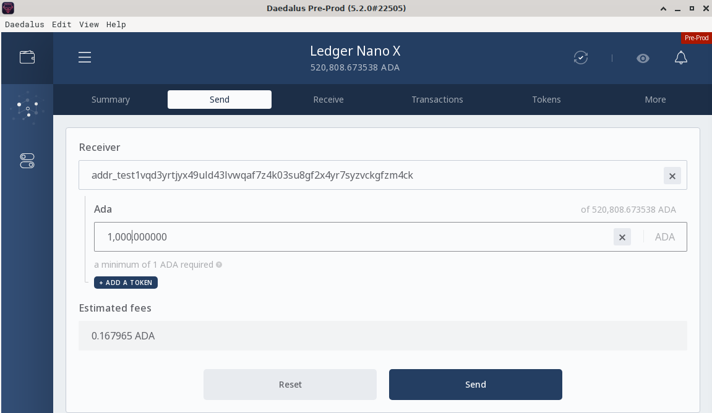

# Các bước chuẩn bị

### **Các bước chuẩn bị để sử dụng bộ khởi động Marlowe Stater Kit**

\
&#xNAN;_&#x54;rước khi chạy notebook này, bạn có thể muốn sử dụng chức năng "xóa đầu ra" của Jupyter để xóa kết quả của lần thực thi trước đó của notebook này. Điều này sẽ giúp làm rõ hơn những gì đã được thực thi trong phiên làm việc hiện tại._

Nền tảng phát triển web3 [demeter.run](https://demeter.run/) cung cấp một tiện ích mở rộng Cardano Marlowe Runtime có chứa các công cụ Marlowe và cung cấp các dịch vụ backend Marlowe Runtime cùng với một node Cardano.&#x20;

Nếu bạn không sử dụng demeter.run, hãy xem trang [docker](https://docs.marlowe.iohk.io/tutorials/playbooks/deploying-marlowe-runtime) để biết hướng dẫn triển khai Marlowe Runtime bằng docker.

Notebook này cung cấp hướng dẫn về việc thiết lập khóa ký và địa chỉ cho bộ khởi động này. Nó bao gồm các thông tin sau:

* Các công cụ Marlowe
* Tạo địa chỉ và khóa ký
* Faucet
* Người cho vay
* Người đi vay
* Obtaining test ada
* Cung cấp tiền cho địa chỉ của các bên
* Sử dụng Daedalus hoặc ví trình duyệt
* Sử dụng faucet cục bộ tại dòng lệnh

Một video hướng dẫn sẽ trình bày qua notebook Jupyter này. Bạn có thể đặt câu hỏi về Marlowe trong kênh [#ask-marlowe](https://discord.com/channels/826816523368005654/936295815926927390) trên Discord của IOG hoặc gửi các vấn đề liên quan đến bài học này vào [danh sách vấn đề](https://github.com/input-output-hk/marlowe-starter-kit/issues) cho kho lưu trữ Marlowe Starter Kit trên GitHub.

### Marlowe Tools[​](https://docs.marlowe.iohk.io/tutorials/guides/preliminaries#marlowe-tools) <a href="#marlowe-tools" id="marlowe-tools"></a>

Ba quy trình thay thế có sẵn để chạy các hợp đồng Marlowe:

* Marlowe CLI (marlowe-cli) cho các thử nghiệm nhẹ với các giao dịch Marlowe.
* Marlowe Runtime CLI (marlowe-runtime-cli) cho các ứng dụng không dựa trên web sử dụng dịch vụ backend Marlowe Runtime.
* Marlowe Runtime Web (marlowe-web-server) cho các ứng dụng web sử dụng dịch vụ backend Marlowe Runtime.

Marlow Runtime cung cấp nhiều dịch vụ xây dựng giao dịch, quản lý UTxO, truy vấn và gửi cho việc sử dụng các hợp đồng Marlowe: điều này giúp dễ dàng chạy các hợp đồng Marlowe mà không cần quan tâm đến các chi tiết của sổ cái Cardano và các hợp đồng thông minh Plutus. Ngược lại, Marlowe CLI không hỗ trợ truy vấn và quản lý UTxO, vì vậy nó phù hợp nhất cho các nhà phát triển Cardano có kinh nghiệm.


Truy cập vào nút Cardano và Marlowe Runtime

Nếu chúng ta đang sử dụng tiện ích mở rộng Cardano Marlowe Runtime của demeter.run, thì chúng ta đã có quyền truy cập vào Cardano Node và Marlowe Runtime.&#x20;

Các lệnh sau sẽ thiết lập các biến môi trường cần thiết để sử dụng một triển khai docker cục bộ trên các cổng mặc định. Nó cũng sẽ thiết lập một số biến môi trường bổ sung.

_Mẹo: Khi chạy Cardano node với mainnet, thời gian đồng bộ có thể rất lớn do kích thước của chuỗi. Hãy cân nhắc chạy nút trên phần cứng tốt hơn và cho phép đủ thời gian để đồng bộ hoàn toàn._

Kiểm tra trạng thái của nút bằng lệnh `cardano-cli query tip --testnet-magic $CARDANO_TESTNET_MAGIC`.

Thiết lập `CARDANO_TESTNET_MAGIC=1` cho preprod hoặc `CARDANO_TESTNET_MAGIC=2` cho preview. Nếu không, hãy bỏ qua cờ này cho mainnet.

```bash
if [[ -z "$MARLOWE_RT_PORT" ]]
then

  # chỉ yêu cầu cho `marlowe-cli` and `cardano-cli`.
  export CARDANO_NODE_SOCKET_PATH="$(docker volume inspect marlowe-starter-kit_shared | jq -r '.[0].Mountpoint')/node.socket"
  export CARDANO_TESTNET_MAGIC=1 # lưu ý preprod=1 and preview=2. Không được cài đặt 2 tham số này nếu chạy trên mainnet.

fi

# FIXME: This should have been inherited from the parent environment.
if [[ -z "$CARDANO_NODE_SOCKET_PATH" ]]
then
  export CARDANO_NODE_SOCKET_PATH=/ipc/node.socket
fi

# FIXME: This should have been set in the parent environment.
if [[ -z "$CARDANO_TESTNET_MAGIC" ]]
then
  export CARDANO_TESTNET_MAGIC=$CARDANO_NODE_MAGIC
fi

echo "CARDANO_NODE_SOCKET_PATH = $CARDANO_NODE_SOCKET_PATH"
echo "CARDANO_TESTNET_MAGIC = $CARDANO_TESTNET_MAGIC"
```

```
CARDANO_NODE_SOCKET_PATH = ~/.local/share/containers/storage/volumes/marlowe-starter-kit_shared/_data/node.socket
CARDANO_TESTNET_MAGIC = 1
```

Lưu ý thông số cài đặt các mạng testnet:

* `preprod` = 1
* `preview` = 2

### Tạo địa chỉ và khóa ký&#x20;

[Cổng thông tin nhà phát triển Cardano](https://developers.cardano.org/docs/stake-pool-course/handbook/keys-addresses/) chứa hướng dẫn để tạo địa chỉ và khóa ký. Bộ công cụ khởi động này sử dụng các địa chỉ sau:

* Một Faucet cục bộ **tùy chọn** được sử dụng để cấp vốn cho các bên tham gia hợp đồng Marlowe.
* Bên Cho vay (_Lender_) cho các ví dụ trong bộ công cụ khởi động này.
* Bên Vay (_Borrower_) cho các ví dụ trong bộ công cụ khởi động này.
* Bên Trung gian (_Mediator_) cho một số ví dụ trong bộ công cụ khởi động này.

Các hướng dẫn dưới đây chi tiết cách tạo khóa ký và địa chỉ cho các bên này. Giả sử rằng bạn đã có khóa ký và địa chỉ cho faucet và rằng faucet đã được cấp vốn bằng test ada.

**QUAN TRỌNG**: Thư mục `keys/` chứa các khóa ký sẽ được tạo ra để tương tác với hợp đồng Marlowe. Nếu bạn xóa hoặc mất các tệp này, bạn sẽ mất mãi mãi test ada được lưu trữ tại các địa chỉ đó. Hãy sao lưu các tệp này hoặc, sau khi chạy các bài hướng dẫn, gửi số test ada còn lại về một ví dụ vĩnh viễn hơn hoặc trả lại cho faucet.

#### Faucet&#x20;

Bước này là tùy chọn nếu bạn đang sử dụng một ví dụ ví đã được cấp vốn bằng test ada. Đặt tên tệp cho khóa ký và khóa xác minh của bên này.

```
FAUCET_SKEY=keys/faucet.skey
FAUCET_VKEY=keys/faucet.vkey
```

Tạo các khóa (keys) nếu bạn chưa có.

```
if [[ ! -e "$FAUCET_SKEY" ]]
then
  cardano-cli address key-gen \
    --signing-key-file "$FAUCET_SKEY" \
    --verification-key-file "$FAUCET_VKEY"
fi
```

Tạo địa chỉ faucet trên testnet.

```
FAUCET_ADDR=$(cardano-cli address build --testnet-magic "$CARDANO_TESTNET_MAGIC" --payment-verification-key-file "$FAUCET_VKEY" )
echo "$FAUCET_ADDR" > keys/faucet.address
echo "FAUCET_ADDR = $FAUCET_ADDR"
```

```
FAUCET_ADDR = addr_test1vq9prvx8ufwutkwxx9cmmuuajaqmjqwujqlp9d8pvg6gupczgtm9j
```

#### Bên cho vay - Lender[​](https://docs.marlowe.iohk.io/tutorials/guides/preliminaries#the-lender) <a href="#the-lender" id="the-lender"></a>

Đặt tên cho khóa ký và khóa xác thực.

```
LENDER_SKEY=keys/lender.skey
LENDER_VKEY=keys/lender.vkey
```

Tạo các khóa (keys) nếu bạn chưa có.

```
if [[ ! -e "$LENDER_SKEY" ]]
then
  cardano-cli address key-gen \
    --signing-key-file "$LENDER_SKEY" \
    --verification-key-file "$LENDER_VKEY"
fi
```

Tạo địa chỉ của bên cho vay.

```
LENDER_ADDR=$(cardano-cli address build --testnet-magic "$CARDANO_TESTNET_MAGIC" --payment-verification-key-file "$LENDER_VKEY" )
echo "$LENDER_ADDR" > keys/lender.address
echo "LENDER_ADDR = $LENDER_ADDR"
```

```
LENDER_ADDR = addr_test1vqd3yrtjyx49uld43lvwqaf7z4k03su8gf2x4yr7syzvckgfzm4ck
```

#### Bên vay - Borrower[​](https://docs.marlowe.iohk.io/tutorials/guides/preliminaries#the-borrower) <a href="#the-borrower" id="the-borrower"></a>

Đặt tên cho khóa ký và khóa xác thực.

```
BORROWER_SKEY=keys/borrower.skey
BORROWER_VKEY=keys/borrower.vkey
```

Tạo các khóa (keys) nếu bạn chưa có.

```
if [[ ! -e "$BORROWER_SKEY" ]]
then
  cardano-cli address key-gen \
    --signing-key-file "$BORROWER_SKEY"  \
    --verification-key-file "$BORROWER_VKEY"
fi
```

Tạo địa chỉ của bên cho vay.

```
BORROWER_ADDR=$(cardano-cli address build --testnet-magic "$CARDANO_TESTNET_MAGIC" --payment-verification-key-file "$BORROWER_VKEY" )
echo "$BORROWER_ADDR" > keys/borrower.address
echo "BORROWER_ADDR = $BORROWER_ADDR"
```

```
BORROWER_ADDR = addr_test1vpy4n4peh4suv0y55yptur0066j5kds8r4ncnuzm0vpzfgg0dhz6d
```

#### Bên trung gian - Mediator[​](https://docs.marlowe.iohk.io/tutorials/guides/preliminaries#the-mediator) <a href="#the-mediator" id="the-mediator"></a>

Đặt tên cho khóa ký và khóa xác thực.

```
MEDIATOR_SKEY=keys/mediator.skey
MEDIATOR_VKEY=keys/mediator.vkey
```

Tạo các khóa (keys) nếu bạn chưa có.

```
if [[ ! -e "$MEDIATOR_SKEY" ]]
then
  cardano-cli address key-gen \
    --signing-key-file "$MEDIATOR_SKEY"  \
    --verification-key-file "$MEDIATOR_VKEY"
fi
```

Tạo địa chỉ của bên trung gian.

```
MEDIATOR_ADDR=$(cardano-cli address build --testnet-magic "$CARDANO_TESTNET_MAGIC" --payment-verification-key-file "$MEDIATOR_VKEY" )
echo "$MEDIATOR_ADDR" > keys/mediator.address
echo "MEDIATOR_ADDR = $MEDIATOR_ADDR"
```

```
MEDIATOR_ADDR = addr_test1vr6tytqs3x8qgewhw89m3xrz58t3tqu2hfsecw0u06lf3hg052wsv
```

### Nhận test ada&#x20;

Để thực hiện giao dịch trên mạng Cardano, bạn cần có ADA native crypto để trả phí và sử dụng làm quỹ. Có các faucet cho các testnet công khai tại [đây](https://docs.cardano.org/cardano-testnet/tools/faucet) (bạn có thể nhận test ada hàng ngày)

Tùy chọn, việc quản lý quỹ một cách trung tâm bằng ví Daedalus hoặc một trong các ví trình duyệt web có thể thuận tiện: hãy chắc chắn chọn đúng testnet công khai nếu sử dụng một trong các ví này.

Nếu bạn sẽ sử dụng một faucet cục bộ, hãy gửi test ada đến địa chỉ faucet được tạo ra ở phần trước. Nếu không, hãy gửi test ada đến ví Daedalus hoặc ví trình duyệt web.

```
echo "FAUCET_ADDR = $FAUCET_ADDR"
```

```
FAUCET_ADDR = addr_test1vq9prvx8ufwutkwxx9cmmuuajaqmjqwujqlp9d8pvg6gupczgtm9j
```

### Cấp quỹ cho địa chỉ các bên liên quan[​](https://docs.marlowe.iohk.io/tutorials/guides/preliminaries#fund-the-addresses-of-the-parties) <a href="#fund-the-addresses-of-the-parties" id="fund-the-addresses-of-the-parties"></a>

Chúng ta sẽ cấp cho các địa chỉ 1000 test ADA.

```
echo "LENDER_ADDR = $LENDER_ADDR"
echo "BORROWER_ADDR = $BORROWER_ADDR"
echo "MEDIATOR_ADDR = $MEDIATOR_ADDR"
```

```
LENDER_ADDR = addr_test1vqd3yrtjyx49uld43lvwqaf7z4k03su8gf2x4yr7syzvckgfzm4ck
BORROWER_ADDR = addr_test1vpy4n4peh4suv0y55yptur0066j5kds8r4ncnuzm0vpzfgg0dhz6d
MEDIATOR_ADDR = addr_test1vr6tytqs3x8qgewhw89m3xrz58t3tqu2hfsecw0u06lf3hg052wsv
```

#### Sử dụng Daedalus hoặc ví trình duyệt web

&#x20;Nếu bạn đã có ví chứa test ada, bạn có thể chỉ cần gửi quỹ đến các địa chỉ của các khóa mà chúng ta đã tạo ở phần trước.&#x20;

Hình chụp màn hình bên dưới minh họa việc sử dụng Daedalus để cấp quỹ cho địa chỉ của bên cho vay.



#### Sử dụng faucet cục bộ từ dòng lệnh&#x20;

Bạn có thể sử dụng `cardano-cli` hoặc `marlowe-cli` để gửi quỹ đến một địa chỉ. Ở đây, chúng ta sử dụng marlowe-cli.&#x20;

Nếu bạn vừa cấp quỹ cho `FAUCET_ADDR` với tada, có thể bạn sẽ phải chờ vài phút trước khi giao dịch đó được xác nhận. Nếu lệnh dưới đây không thành công, hãy thử lại cho đến khi thành công.

```
# Lưu ý: `FAUCET_ADDR` phải được nhận tADA trước khi thực hiện giao dịch

# 1 ada = 1,000,000 lovelace
ADA=1000000

# Send 1000 ada
AMOUNT=$((1000 * ADA))

# Execute the transaction.
marlowe-cli util fund-address \
 --lovelace "$AMOUNT" \
 --out-file /dev/null \
 --source-wallet-credentials "$FAUCET_ADDR":"$FAUCET_SKEY" \
 --submit 600 \
 "$LENDER_ADDR" "$BORROWER_ADDR" "$MEDIATOR_ADDR"
```

```
TxId "8461a35e612b38d4cb592e4ba1b7f13c2ff2825942d66e7200acc575cd4c8f1c"
```

See that the addresses have indeed been funded:

```
echo
echo "Lender @ $LENDER_ADDR"
cardano-cli query utxo --testnet-magic "$CARDANO_TESTNET_MAGIC" --address "$LENDER_ADDR"
echo

echo
echo "Borrower @ $BORROWER_ADDR"
cardano-cli query utxo --testnet-magic "$CARDANO_TESTNET_MAGIC" --address "$BORROWER_ADDR"
echo

echo
echo "Mediator @ $MEDIATOR_ADDR"
cardano-cli query utxo --testnet-magic "$CARDANO_TESTNET_MAGIC" --address "$MEDIATOR_ADDR"
echo
```

```
Lender @ addr_test1vqd3yrtjyx49uld43lvwqaf7z4k03su8gf2x4yr7syzvckgfzm4ck
                           TxHash                                 TxIx        Amount
--------------------------------------------------------------------------------------
8461a35e612b38d4cb592e4ba1b7f13c2ff2825942d66e7200acc575cd4c8f1c     1        1000000000 lovelace + TxOutDatumNone


Borrower @ addr_test1vpy4n4peh4suv0y55yptur0066j5kds8r4ncnuzm0vpzfgg0dhz6d
                           TxHash                                 TxIx        Amount
--------------------------------------------------------------------------------------
8461a35e612b38d4cb592e4ba1b7f13c2ff2825942d66e7200acc575cd4c8f1c     2        1000000000 lovelace + TxOutDatumNone


Mediator @ addr_test1vr6tytqs3x8qgewhw89m3xrz58t3tqu2hfsecw0u06lf3hg052wsv
                           TxHash                                 TxIx        Amount
--------------------------------------------------------------------------------------
8461a35e612b38d4cb592e4ba1b7f13c2ff2825942d66e7200acc575cd4c8f1c     3        1000000000 
```
